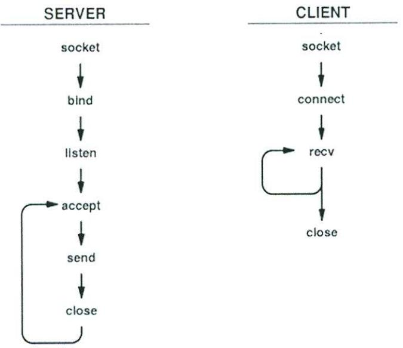
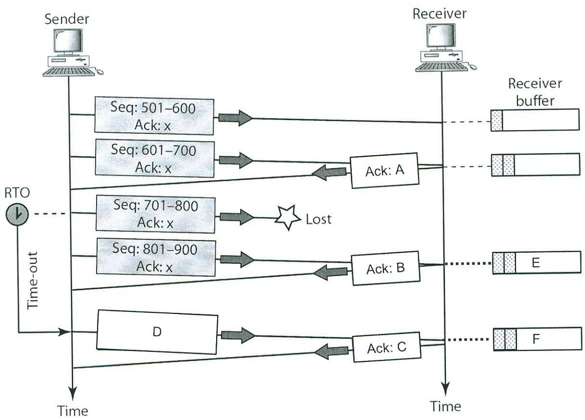

15/1/2019

09.30 - 11.30am

Basement 3, Kevin Street


DUBLIN INSTITUTE OF TECHNOLOGY

DT228 BSc. (Honours) Degree in Computer Science

Year 3

DT282 BSc. (Honours) Degree in Computer Science

(International)

Year 3

WINTER EXAMINATIONS 2018/19

CLIENT SERVER PROGRAMMING [CMPU3006]

MR. DAMIAN BOURKE DR. DEIRDRE LILLIS DR. MARTIN CRANE

THURSDAY 15™ JANUARY 9.30 A.M. - 11.30 A.M..

TWO HOURS

INSTRUCTIONS TO CANDIDATES

Attempt all questions. NOT all questions carry the same mark.

PAGE 1 OF 6

- 1. Refer to Figure 1 (A snippet of code) and the following list of terms:
1

MAXLINE, IPPROTO UDP, &servAddr, SOCK STREAM, clntSock, inet pton, AF INET, sock, sin port, IPPROTO TCP.

- Using line numbers, identify which XXXX value can be replaced with which term from the (i) above list. (12 marks)
- State whether this is a client or server application justifying your answer. (ii) (4 marks)
- If this snippet of code is derived from a Daytime application, identify the socket primitive (iii) that would be called after line 27. (4 marks)

```
... . IGNORE ALL PRIOR LINES .
2
3
4
    char *servIP = arqv [1] ;
5
    in port t servPort = atoi (argv [2] ) ;
6
7
    int sock = socket (AF INET, SOCK STREAM, XXXX) ;
8
    if (sock < 0)
 თ
          DieWithSystemMessage("socket () failed");
10
    struct sockaddr in servAddr;
11
    memset (XXX, 0, sizeof (servAddr) ) ;
12
    servAddr.sin family = XXXX;
13
14
    int rtnVal = XXXX(AF INET, servIP, &servAddr.sin addr.s addr) ;
15
16
    if (rtnVal == 0)
17
18
    DieWithUserMessage("Failed", "invalid address strinq");
    else if (rtnVal < 0)
19
                 DieWithSystemMessage ("inet pton ( ) failed" ) ;
20
21
    servAddr. XXXX = htons (servPort) ;
22
23
    if (connect (XXXX, (struct sockaddr *) &servAddr, sizeof (servAddr) ) < 0)
24
25
          DieWithSystemMessage ("connect ( ) failed" ) ;
26
    ... . IGNORE ALL SUBSEQUENT LINES .
27
28
```
Figure 1: A snippet of code.

- 2. In relation to Application Layer protocols and using the example of a HTTP/1.1 client application requesting and receiving the Homepage from the DIT webserver:
	- (i) Explain the concept of Semantics in relation to the HTTP client and server applications communicating with each other. (6 marks)
	- (ii) Explain the concept of Syntax in relation to the exchange of HTTP Request/Response messages. In your answer include a Protocol Box diagram to illustrate the basic structure of HTTP messages. (6 marks)

- (iii) For retrieval of the Homepage from the DIT webserver, construct an appropriate HTTP/1.1 Request and Response message identifying and explaining any compulsory/necessary fields to ensure the applications will communicate with each other successfully. In your answer identify all termination strings and ignore non-compulsory/non-essential header fields.
(8 marks)

- 3. Consider applications running on two hosts connected as per Figure 2 (Two applications communicating across a network.) The applications are communicating with each other across the network using TCP/IP. This communication results in a number of encapsulated PDUs moving across the network with each PDU containing addressing information.
You are required to:

- (i) Identify and illustrate, for each direction of communication, the correct sequence of encapsulated PDUs contained in the transmitted PDUs X and Y as per the figure. In your illustration identify the type of PDU used at each of the protocol lavers and identify all addressing identifiers (source and destination) used in each of the PDU headers. Assume that the Data Field is on the right hand side of PDUs X and Y. (5 marks)
- For PDUs X and Y, explain where and how any of the addresses contained in the PDU (ii) headers (including the encapsulated PDUs) may change. (5 marks)
- Identify, for each of the hosts, how the local TCP entity would represent the connection (iii) using Socket Pair notation. (5 marks)

Refer to the diagram for Port and IP address identifiers. For MAC addresses, use the terms "Host A MAC", "Router A-side MAC" etc.

| Host A |  |  | Host B |
| --- | --- | --- | --- |
| Application running on Port 1234 |  |  | Application running on Port 80 |
| 200.100.0.55 |  |  | 147.252.10.30 |
|  | × |  |  |
|  | 200.100.0.1 | 147.252.10.1 |  |
|  |  | Router | V |

Figure 2: Two applications communicating across a network.

- Figure 3 (A sequence of Socket Primitives) shows a sequence of socket primitives for a Client and 4. Server application.
	- Identify which primitives, on both the client and server applications, relate to each of the (i) (5 marks) Three Phases of Communication.
	- Identify which of the applications discussed in class: Daytime, Echo and HTTP, this (ii) sequence of socket primitives would suit. Justify your answer by describing the data interaction between the client and server components of your chosen application. (5 marks)
	- With reference to the loop in the server application, explain how the send() primitive can be (iii) called in subsequent iterations despite the call to the close() primitive in the previous (5 marks) iteration. In your answer refer to the listening and connected sockets.



Figure 3: A sequence of Socket Primitives.

- 5. Refer to Figure 4 (Output from Netstat) which shows output from running the Netstat command separately on two hosts supporting a HTTP client-server application.
	- (i) There are values missing from this output listing which are identifiable by the letters A through to F inclusively. Identify which of the following data elements would be most suitable to replace each letter:

147.252.234.34:4136 0.0.0.0:* 147.252.30.9:80 147.252.30.9:80 0.0.0.0:80 147.252.234.34:4136

TCP

0

3

(6 x 2 marks)

ESTABLISHED

- Identify which lines, 1, 2 and 3, relate to the client TCP entity and which relate to the server (ii) TCP entity. Justify your answer. (3 marks)

| ine | | Proto | Recv-O | Send-Q | Local Address | Foreign Address | State |
| --- | --- | --- | --- | --- | --- | --- |
|  | TCP |  |  |  |  | LISTEN |
|  | TCP |  |  |  |  | ESTABLISHED |
| ine | | Proto | Recv-Q | Send-Q | Local Address | Foreign Address | State |

E 0

Figure 4: Output from Netstat.

F

- Refer to Figure 5 (A sequence of segment exchanges) which shows a sequence of segment 6. exchanges between Sender and Receiver hosts. As shown in the figure one of the segments is 'Lost' in transit. In relation to the approach used by the TCP entities to recover from this scenario explain the following:
	- Identify the sequence numbers contained in each of the Acks labelled A, B and C. In your (i) (6 marks) answer explain your rationale.
	- Identify the sequence numbers contained in the segment labelled D. (3 marks) (ii)
	- Recreate the Receiver Buffers as per labels E and F in your answer book. Each of the (iii) shaded boxes represents a stored segment. Insert any additional shaded boxes you deem necessary at the appropriate time location(s) to reveal the true status of the Receiver Buffer at these times. (6 marks)



Figure 5: A sequence of segment exchanges.

Page 6 of 6

