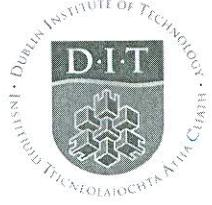

18/1/2019

09.30 - 11.30am

National Stadium, Irish Athletic Boxing Centre

DUBLIN INSTITUTE OF TECHNOLOGY

## DT211C/3 BSc. (Honours) Degree in Computer Science (Infrastructure) DT8900/1 International Pre-Masters for

MSc in Computing

WINTER EXAMINATIONS 2018/2019

CLOUD COMPUTING [CMPU3007]

MR. BRIAN GILLESPIE DR. DEIRDRE LILLIS DR. DAVID MALONE - DT211C

9.30 A.M. - 11.30 A.M. FRIDAY 18TH JANUARY

TWO HOURS

Question 1 is compulsory. Answer question 1 and any two of the other three questions. Question 1 is worth 50 marks, all other questions are worth 25 marks

Illustrate your answers with appropriate examples and diagrams

Page 1 of 3

Define cloud computing in terms of four of its essential characteristics as described by the NIST 1 (a) definition of cloud computing.

(12 Marks)

Distinguish between vertical scaling and horizontal scaling. Give an example when you would (b) use each approach.

(10 Marks)

Define what is meant by the following kinds of cloud computing deployments. State the key (c) differences between them.

> Private 0

Public .

(8 Marks)

Explain the term serverless computing. Do you consider serverless to be an example of the laaS (d) model or the PaaS model? Why?

(10 Marks)

Cloud computing is not without its critics. What are some of the issues you see with Cloud (e) Computing?

(10 Marks)

Virtualisation means the presentation of some abstracted logical view of one or more physical resources. 2 (a) Discuss this statement with respect to the following:

> CPU .

9 Network

0 Storage

(12 Marks)

Define what is meant by a container in the context of virtualization. What is the relationship (b) between Docker and containers?

(5 Marks)

(c) Write the docker commands for the following operations on containers:

Run a container from an image called my-image as a daemon using the name my-0 server

Open a shell within a running container called my-server 0

(8 Marks)

3 (a) Describe five features and benefits of the infrastructure-as-a-service (laaS) model.

(15 Marks)

(b) With SLA agreements as weak as 99.9% uptime, it is the customer's responsibility to manage the resilience of cloud application deployment beyond that. What mechanisms, provided by laaS vendors can be used to provide higher availability and resilience and how do they achieve this?

(10 Marks)

Describe three cloud management interface types and list one strength and one weakness of 4 (a) each.

(12 Marks)

(b) REST is an architectural pattern for creating client-server network APIs based on HTTP. In the context of REST, briefly explain the following concepts:

> Items and collections resources o

. Idempotence

{

}

Universal Resource Identifiers (URIs) 0

(9 Marks)

Explain what the following RESTful API call is doing. (c)

curl - X POST https://api.example.com/customers/237324632/notices -d

"subject": "Account status",

"Dear john, please review your outstanding balance ... ", "body": "delivery": "urgent"

(4 Marks)

