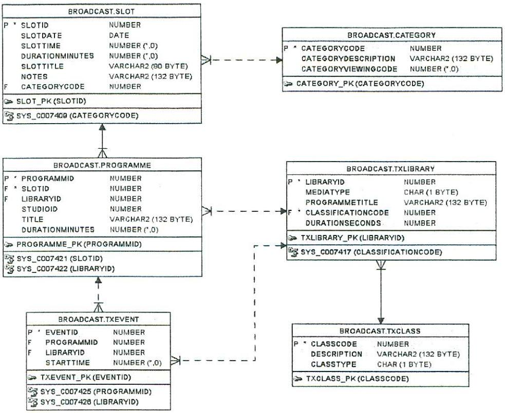

DUBLIN INSTITUTE OF TECHNOLOGY

## DT211C BSc. (Honours) Degree in Computer Science (Infrastructure)

Year 3

DT228 BSc. (Honours) Degree in Computer Science

Year 3

DT282 BSc. (Honours) Degree in Computer Science (International)

Year 3

WINTER EXAMINATIONS 2018/2019

Databases 2 [CMPU3010]

Mr. Ciarán Kelly

Wednesday 9th January

2.00 P.M. - 4.00 P.M.

Instructions to Candidates

Answer Question 1 and TWO others.

There is a syntax sheet at the end of the exam to assist you.

## Figure 1 - Broadcast Library System

A TV station schedules and produces programmes and content for broadcast on its national television network. Planning and scheduling the programmes to be broadcast is a complex process completed in 3 stages.

The planning department draws up broadcast plans for each day in advance. Planners initially identify slots (slot) and the type of content used for a slot e.g.

| SlotTime | DurationMinutes | CategoryDescription |
| --- | --- | --- |
| 09060 |  | News & current affairs |
| 0930 |  | Children's cartoons |
| 1000 |  | Children's hosted "magazine" show |

Table 1 - List of Slots

The Scheduling department searches the transmission library (txLibrary) for programmes to fill up the slots in the broadcast plan. A programme is either a live broadcast from a TV Studio e.g. "the News", or a pre-recorded episode of a serial, a film or a documentary. All pre-recorded material is stored in txLibrary - see the media type table below for a full description. To fill the slots the planner searches the txLibrary for suitable matching programmes (mediaType='G') and links them to the slot. One slot may have one or more matching programmes. Programmes are stored in the "programme" table.

Some programmes are not stored in txLibrary, if the programme is a live broadcast, the libraryld is NULL and the studiold specifies the studio for the source of the broadcast. Information on studio sourced programmes is external to the system - planners manually update the schedule with the required data.

Table 2 below displays a list showing a planned slot and programmes scheduled to fill it with the duration of the programme sourced from the txLibrary.

| Slot | Duration | CategoryDescription | Broadcast | Programme. Title | txLibrary. |
| --- | --- | --- | --- | --- | --- |
| Time | Minutes |  | Type |  | DurationSeconds |
| 0900 | 25 | News & current affairs | Live | Studio Broadcast(news) | 1500 |
| 0930 | 25 | Children's cartoons | Library | Cartoon1 | 460 |
|  |  |  |  | Cartoon2 | 420 |
|  |  |  |  | Cartoon3 | 300 |

Table 2-List of Slots with Programme Information

Presentation Scheduling creates the final schedule for transmission (txEvent) by identifying other media types to broadcast during the programme. These can be still images or animations to identify the station branding (idents) or still images taken from the programme to bookend a commercial break. The presentation schedule takes the start time of the programme and adds additional broadcast events from the transmission library (txLibrary) to create the schedule. Each entry in the presentation schedule is linked to a programme or a studio live broadcast is scheduled from within that event. e.g. if the programme opens with a station ident, then a txEvent record is created for the ident at starttime 0, if there is a commercial break at 10 minutes, then a "sting" media type is broadcast at 600 seconds into the programme.

All planning and programme scheduling is in minutes, transmission scheduling is in seconds. The durations of txEvents increase the duration of the programme so if a slot is 30 minutes and the programme's duration is 29 minutes, then only 1 minute of txevents can be programmed. Table 3 shows a sample presentation scheduled for the 0930 slot shown in table 2.

| Slot. | Programme. | Broadcast | Programme. Title | Media | txEvent | txLibrary. |
| --- | --- | --- | --- | --- | --- | --- |
| SlotTime | Title | Type |  | Type | StartTime | Duration |
|  |  |  |  |  |  | Seconds |
| 0930 | Cartoon1 | Library | Station Ident |  | 0 | 60 |
|  |  |  | Commercial Break Start | C | 460 | 300 |
|  |  |  | Station Promo | D | 760 | 120 |
|  |  |  | Commercial Break End | C | 880 | 10 |
| 0930 | Cartoon2 | Library | Station Ident |  | 0 | 60 |

Table 3- Sample presentation Schedule

The Transmission Library (txLibrary) holds information on actual content being broadcast. Content includes programmes such as movies and serials acquired from other content providers and video sequences such as commercial headers and the many stills and animations used between gaps in programmes. Where a programme is not sourced from a library it is sourced from a live feed – which means a studio broadcast such as the news. This is managed by an external system and is not part of the txLibrary.

| The types of media stored on the library are identified by the mediatype field in the TxLibrary table. These are listed with their descriptions in Table 4 below. |
| --- |
| Comprehensive and the controlled to the controlled to the controlled and development on a concession and consideration and consideration and consideration and consideration o |

| Media Type | Name | Description |
| --- | --- | --- |
| G | ProGramme | Content i.e. Programme media - movies, tv serials, documentaries - this is what people want to watch on TV. |
| P | Promo | short commercial for scheduled content e.g. advertising a new movie |
|  | Ident | TV station branding graphic sequence |
|  | Sting | Specific sequence shown between programme breaks e.g. breaking for news, commercial breaks. |
|  | Commercial | Externally produced content to promote produce or service |

Table 4- txLibrary Media types

- ldentify what tables and privileges the roles Scheduler, presentation scheduler and 1. a) Librarian should have access to. (7 Marks)
	- b) Write SQL for the following queries:

Slot times are stored as integers to represent the 24 hour clock e.g. 9am=0900, 9pm=2100.

Use the TRUNC() function to extract a date from an Oracle "date" datatype, e.g. today's date is TRUNC ( SYSDATE ).

- i. What programmes are scheduled today in the 7am slot - list the slotTime and programme title. (7 Marks)
- ii. What is the full transmission event list for a programme called "Kidz Corner" scheduled today at 11:30am. List the slot time, programme title, mediaType and library title of the event. (7 Marks)
- iii. List the slot time, programme title (programme.title) and the total number of commercial breaks scheduled to start between 4pm and 6pm. Commercial breaks are identified by a library description (txLibrary.programmeTitle) of 'CBStart' (7 Marks)
- The designer of the system is considering using a NoSQL database as the system c) database. Describe an appropriate data structure for a presentation scheduler for the storage and retrieval of transmission event data using MongoDB. (12 Marks)

- The acquisitions manager wishes to buy in some new content for the station e.g. the rights 2. to show a film or a TV police procedural series. The overall budget for acquisitions is agreed at the start of the year, and the manager must not exceed the agreed target. In addition, the budget is broken down by type of TV show and by suitability for a particular age group.
Acquisitions is a complex process and the manager reads many content producer brochures in an effort to plan acquisitions for the year. Each vendor will issue a catalogue of titles for sale - noting that different producers can work on the same title. An example brochure is listed as table 5 below.

| a) Represent the information in unnormalised form | (5 Marks) |
| --- | --- |
| b) Represent the information in first normal form | (5 Marks) |
| c) Represent the information in second normal form | (5 Marks) |
| d) Represent the information in third normal form | (5 Marks) |
| e) | Draw a fully normalised ERD to represent the entities derived by the normalisation |
| process showing primary and foreign keys, attributes and relationships. | (10 Marks) |

Content Provided by: Aardvark TV Content Aggregation, Availability: From 2019

| Title | "A Peculiar Mystery" | "Urban Students' | "Urban Families' Lives" |
| --- | --- | --- | --- |
|  |  | Lives" |  |
| Description | A busy and | The scandal and | The scandal and events in a |
|  | dysfunctional | events in a local | local city |
|  | policeman | seaside town |  |
|  | investigates local |  |  |
|  | goings-on |  |  |
| #Episodes | 8 | 200 | 150 |
| Episode | ୧୦ | 20 | 25 |
| Duration |  |  |  |
| Category | Cops'n'Robbers | Young Peoples | Soap Opera |
|  |  | Soap Opera |  |
| Category | Police procedural | General soap opera | Soap Opera with adult |
| Description | show |  | content. |
| Estimated | 18+ | 12+ | 15+ |
| Age Rating |  |  |  |
| #Showings | 2 | Unlimited | 1 |
| Licence Cost | 10,000 | 20,000 | 40,000 |
| € |  |  |  |
| Producer | Murkwood | Balmain bay | Northsider Productions |
|  | Productions | Productions |  |
| Producer | www.murky.ie | www.balmain.ie | www.northside.ie |
| WWW |  |  |  |
| man and and and and and and and the section of the states |  |  |  |

Table 5 - Catalogue of TV content provided by a particular vendor

- Working from the ERD and system described in Q1, write SQL for the following queries :-3.
	- a) Transmission schedulers need to ensure that all the material used when broadcasting is not overused. Write a query to find the promo or promos (mediatype='P') that have the highest number of entries in todays transmission schedule (txEvent). (5 Marks)
	- b) Using that query, list the programmes (programme.title) that are using those promo(s) in the transmission schedule. (5 Marks)
	- Write a query to find out if there is a programme ID (programme.programmld) that uses c) all the promos (mediaType='P') with a classification (txClass.description) of 'Children's TV" (10 Marks)
	- d) Find a programme scheduled before 6pm today with 7 or more minutes of commercial breaks scheduled.
		- . Commercial breaks are identified by 2 events that have a library title (txLibrary.programmeTitle) of 'CBStart' and 'CBEnd'.
		- The duration of a commercial break is the difference between the start time . values (txEvent.startTime) for the CBStart and CBEnd events. startTime is the number of seconds from the programme start.
		- The eventId's of the CBStart and CBEnd events are always sequential i.e. ● the CBEnd eventId is always that of CBStart + 1 (10 Marks)
- Write a PL/SQL function to create a default entry for a programme in the transmission 4. events table. The function, called "add_default_txEntry" takes the following arguments

## Programmeld Integer

The function performs the following tasks

- Inserts a Station Ident at time 0 (media type=I, libraryId=8) 1.
- 2. Inserts pair of commercial break events at the half way point of the programme, for a duration of 5 minutes – these events have the unique description "CBStart" and "CBEnd" in the library table.
- 3. Inserts a station ident at the end of the programme time is the programme end time, library information is as for #1.

The function should perform standard error checking e.g. to check that the programme id exists and that each insert succeeds. If it does not succeed, the function should raise an error and terminate. Assume that a sequence called "eventSeq" exists to provide a unique value for the txEvent table.

(30 Marks)

AX SHEET HANI

| ડ્વા | /SQL Blo |
| --- | --- |
| CT column-list FROM tablen | DECLAR |
| ERE conditior | onstant/variable declarat |
| DUP BY column-nan /ING condition]; ER BY columu-lis | xecutable stateme TURN <return_valu BEGIN |
|  | XCEPTION |
| ECT column-list FROM join-expre | ception hand |
|  | END |
| in expression |  |
| NG (column-lis | ceptions |
| Table1 LEFT JOIN table2 ON Condition | USING (column Conditions | UP_VAL_ON_INDI O_DATA_FOUND DO_MANY_ROWS |
| =,>, <,>=, <=, <=, <>, |  |
|  | Error Variabl |
| RT INTO tablename [{columnnam union, intersect, min et operations | QLERRM - error me QLCODE - erro |
| SET column-name= <data-value>] [WHER ALUES (data-value-l UPDATE tablenam |  |

unctions

ondition

C(<date>)=return date

1, item: "pencil", qty: 50, type: "no. documents or arrays.
<Embed_ attrib_name> :[{set of embedd.
<Embed_ attrib_name> :[{set of embedd.
 :ttribute}] s:{$in:[ "Unknown","Incomple t a document with id value 11 butes may contain embe reateCollection("conta ail: {$regex: /@mydit\ ate a products collect ione:{$type:"string tem: "pen", qty: 20 tem: "eraser", qty: oducts collection ongoDb Examp .products.inse alidator:{ $or ({{

