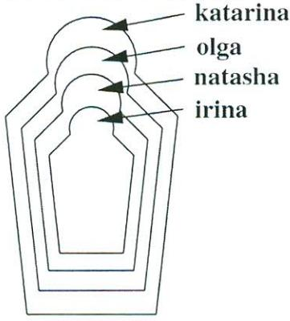

10/1/2019

14.00 - 16.00pm

Basement 1, Kevin Street

DUBLIN INSTITUTE OF TECHNOLOGY

DT228 BSc. (Honours) Degree in Computer Science

Year 3

## WINTER EXAMINATIONS 2018/2019

INTRODUCTION TO ARTIFICIAL INTELLIGENCE [CMPU3051]

MR RICHARD LAWLOR

THURSDAY 10TH JANUARY 2.00 P.M. - 4.00 P.M.

2 HOURS

INSTRUCTIONS TO CANDIDATES ANSWER FOUR QUESTIONS OUT OF FIVE. ALL QUESTIONS CARRY EQUAL MARKS.

## Financial Advisor Knowledge 1

The function of the advisor is to help a user decide whether to invest in a savings account or the stock market. Some investors may want to split their money between the two. The investment that will be recommended for individual investors depends on their ancome and the current amount they have saved according to the following criteria:

- Individuals with an inadequate savings account should always make increasing the 1. amount saved their first priority, regardless of their income.
- 2. Individuals with an adequate savings account and an adequate income should consider a riskier but potentially more profitable investment in the stock market.
- Individuals with a lower income who already have an adequate savings account may 3 want to consider splitting their surplus income between savings and stocks, to increase the cushion in savings while attempting to increase their income through stocks.

The adequacy of both savings and income is determined by the number of dependents an individual must support. The rule is to have at least €5,000 in the bank for each dependent. An adequate income must be a steady income and supply at least €15,000 per year plus an additional €4,000 for each dependent.

Note that if the amount saved is greater than the minimum savings, then the savings account is deemed adequate, otherwise inadequate. Similarly with the adequacy/inadequacy of the income.

(a) Express the above knowledge in the Predicate Calculus in terms of the following predicates and functions:

amount saved/1, dependents/1, earnings/2 savings account/1, income/1, investment/1 minsavings(Y) and minincome(Y) (functions).

|  | (8 marks) |
| --- | --- |
| (b) Translate your knowledge described in part (a) into Prolog. |  |
|  | (8 marks) |
| (c) Describe the architecture of a rule-based expert system. |  |
|  | (9 marks) |

- 2 (a) Outline three sources of uncertain knowledge.
(6 marks)

- (b) Give three reasons why Bayesian reasoning is difficult to use in an expert system. Also, briefly describe three advantages in using certainty factors as opposed to Bayesian reasoning. Briefly mention two well-known historical expert systems, one of which used Bayesian reasoning and the other certainty factors.
(10 marks)

- Given the forecasting rules below, show how they would fire to forecast tomorrow's (c) weather when provided with the following information: there is rain today and the rainfall is low with a certainty factor of 0.8, and also it is cold with a certainty factor of 0.9. This formula may be useful:
cf(cf1, cf2) = cf1 + cf2 × (1 - cf1)

Rule: 1

if today is rain then tomorrow is rain {cf 0.5}

Rule: 2

if today is dry then tomorrow is dry {cf 0.5}

Rule: 3

if today is rain and rainfall is low then tomorrow is dry {cf 0.6}

Rule: 4

if today is rain and rainfall is low and temperature is cold then tomorrow is dry {cf 0.7}

Rule: 5

if today is dry and temperature is warm then tomorrow is rain {cf 0.65}

Rule: 6

if today is dry and temperature is warm and sky is overcast then tomorrow is rain {cf 0.55}

(9 marks)

- 3 (a) Given facts like the following: bicycleLane(dublin, kilkenny, 120). bicycleLane(dublin, carlow, 80). bicycleLane(kilkenny, waterford, 85). bicycleLane(mallow, carlow, 110). bicycleLane(cork, mallow, 38). bicycleLane(waterford, youghal, 110). bicycleLane(youghal, cork, 30). bicycleLane(dublin, athlone, 105). bicycleLane(athlone, limerick, 135). bicycleLane(limerick, cork, 75).
write a Prolog predicate canGoFromTo(A, B, Dist, Route) which will tell you if you can ride a bicycle from town A to town B even if you have to pass thru other towns, and it will also compute the total distance as well as the route followed in going from A to B. You can assume that bicycle lanes are one-way and no loops are exist.

(10 marks)

- What is the meaning and difference if any in the following two Prolog clauses? (b) a : - not ( city (dublin) ) . a : - city (X) , X \ == dublin.
(5 marks)

Write a Prolog predicate fac(N, X) to compute the factorial of N. (c)

(5 marks)

- Given the information expressed in the Russian doll diagram, write a knowledge base (d) using the predicate directlyIn/2 which encodes which doll is directly contained in which other doll. Then, define a recursive predicate in/2 , that tells us which doll is (directly or indirectly) contained in which other dolls.

(5 marks)

- What is a perceptron? Draw a diagram for a single two-input perceptron. Explain what 4 (a) is meant by linear separability. How many categories can it classify inputs into? Mention any issues involved in using a perceptron to compute logical AND, OR and XOR.
(7 marks)

- Illustrate the single perceptron training algorithm for an OR gate by computing the (b) weight adjustments for the first three epochs in the table below.
(5 marks)

- Draw a multilayer perceptron diagram that would be appropriate for an XOR gate. (c) Name and draw the activation function which is suitable for a multilayer perceptron.
Comment briefly on its learning algorithm.

(8 marks)

- (d) Explain the problem of overtraining an artificial neural network and how it could be alleviated.
(5 marks)

## Perceptron Training for logical OR

Threshold 0 = 0.2, learning rate a = 0.1.

| Epoch | Inputs |  | Desired output | Weights |  | Weighted Sum | Actual Output | Error | Weight adjustments |  |
| --- | --- | --- | --- | --- | --- | --- | --- | --- | --- | --- |
|  | X1 | ×2 | Yd | W1 | W2 | × | Y | e | △W1 | △W2 |
| 1 | 0 | O | O | -0.2 | 0.1 |  |  |  |  |  |
|  | 0 | 1 | 1 |  |  |  |  |  |  |  |
|  | 1 | 0 | 1 |  |  |  |  |  |  |  |
|  | 1 | 1 | 1 |  |  |  |  |  |  |  |
| 2 | 0 | 0 | 0 |  |  |  |  |  |  |  |
|  | 0 | 1 | 1 |  |  |  |  |  |  |  |
|  | 1 | O | 1 |  |  |  |  |  |  |  |
|  | 1 | 1 | 1 |  |  |  |  |  |  |  |
| 3 | O | O | 0 |  |  |  |  |  |  |  |

Table 4(b)

- 5 (a) Distinguish between classification and regression in machine learning.
Briefly describe the Fashion MNIST dataset and outline how it could be used to train a 3-layer classification neural network.

(5 marks)

- Explain what the following TensorFlow code segment does and what is returned by (b) the operation load data().
fashion = keras.datasets.fashion mnist (train images,train labels), (test images, test_labels) = fashion.load_data()

What would one expect when the following expression is evaluated? train images.shape, train labels.shape

(5 marks)

- Explain what the following TensorFlow code segment does and briefly describe in (c) your answer the meaning of Flatten and Dense. How many layers are in this network and how many neurons in each layer? How many weights are there in the middle and output layers?
test images = test images/255.0 train images = train_images/255.0 model = keras.Sequential([ keras.layers.Flatten(input shape=(28, 28)), keras.layers.Dense(256, activation=tf.nn.relu), keras.layers.Dense(10, activation=tf.nn.softmax) ])

What is the softmax() activation function and what is it supposed to do here?

(10 marks)

- (d) Explain what the following TensorFlow code segment does.
model.fit(train images, train labels, epochs=10) test loss, test acc = model.evaluate(test images, test labels) pred = model.predict(test images) pred.shape

(5 marks)

| a ma marsum at politici at politici and moltant consistential programas pen grande () (a) e |
| --- |
| a mast of base ad blace it wolf anilain has resuals Teller 4 mades on schwast grainle |
| blance chaps themically and nother a |

(hanna E)

- yd tevraden af tadar hina wasir aren and tanana sana sama sana sanar sana malagan (o). t irrab, Libi mana sitt
- ໄຫຼເກົາ. Pontatible "scutain ne 16st = ສະຖານສາຕະ (laran_beal.noidea) = [dodd]_fast_esgarm_terr] ]ell=dai_mistre_spech(_migri)
- Photolová a motoropas interviled adi mai a magga tran bionar mille Siji-ila..ledel_ibr i2., syste.zagem_mag ະປະເທດ 2.)
	- al adiosap xillaisé bas problém anu an étionnai ganusilói adhisemainnyit pa das aton anti mi ann and quipt. Papi Kirji Khil Kamal 1 1 - gumenting transan neux hus afbhan adt of mach ans saighter grain van H Vw ant d ato in transker ymat, wond him Tandrol Iniqtoo
		- לפיות (מופרס נפל ישראן) (18) 1 ്ക്ക് പട്ടുണ്ടുന്നു. പത്രാന്‍ പ്രസ line de supe arcal « ferma 1185 Bilangsar Jaquloshad Lategal episo
	- .[ulletting transis are . 3] University, stevel a sax kəndlər.rut təmsiləsinə yarla, təqli məşğul etmək

Carid dhion Starogair in le nathr han a mhealth ann an comhar adh air it (azhina) Dill)

- rani memgaz sono w 4 monut un a charadi naha mahayi. cha
	- (200-04000) platin produktion in menj Wilsbon ﺍﻟﻤﺴﺎﻋﺪ ﺍﻟﻤﺴﺎﻋﺪ ﺍﻟﻤﺴﺎﻋﺪ ﺍﻟﻤﺴﺎﻋﺔ ﺍﻟﻤﻮﺿﻮﻋﺎﺕ ﺍﻟﻤﻮﺍﺿﻴﻊ ﺍﻟﻤﻮﺍﺿﻴﻊ ribi » 1-Suiten and estatus hang 1964 NOVE

(18mn č.)

