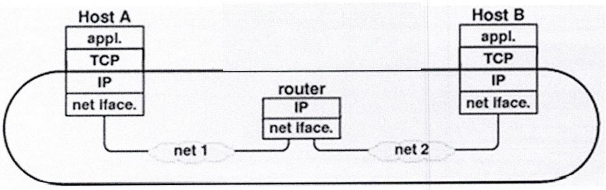
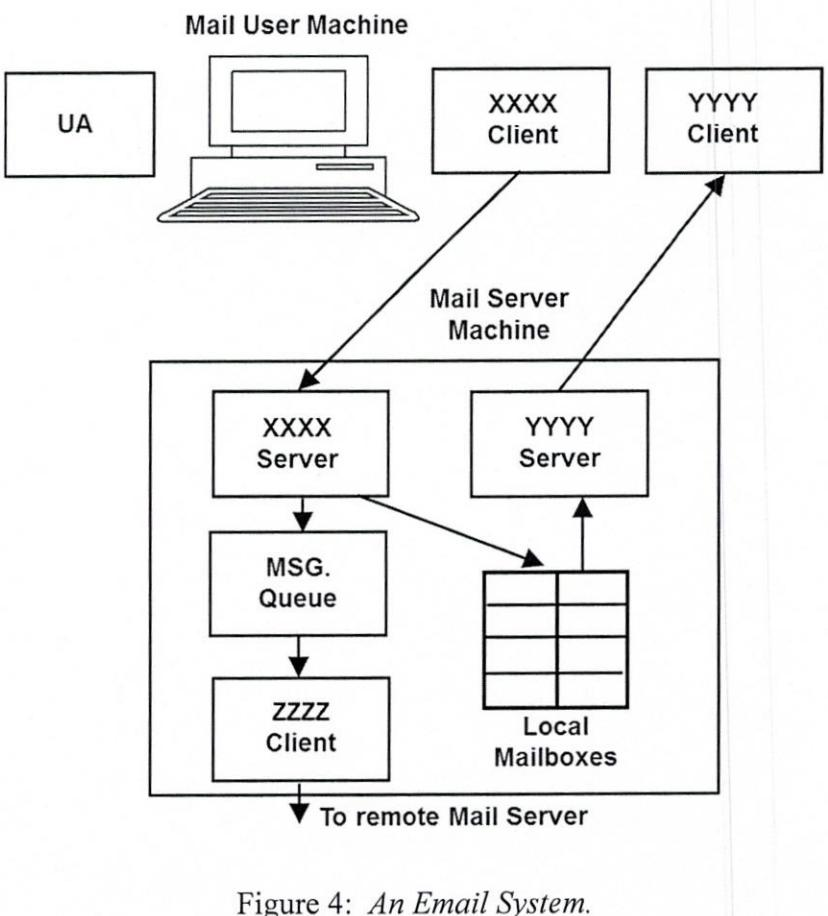
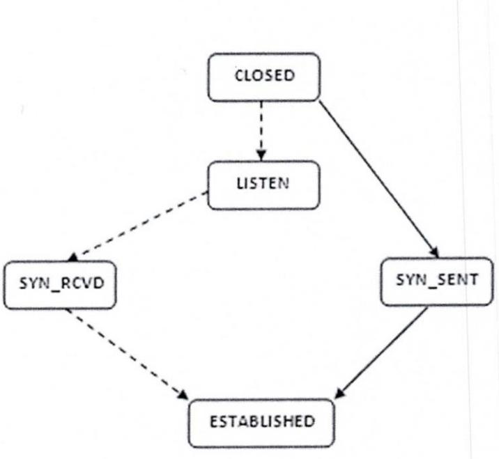
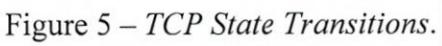

14.01.20

09.30 - 11.30am

CMPU 3006 Client Serving Programming

Basement 3, Kevin Street

Programme Code: DT228, DT282 Module Code: CMPU 3006 CRN: 22404, 30085

## TECHNOLOGICAL UNIVERSITY DUBLIN

KEVIN STREET CAMPUS

# BSc. (Honours) Degree in Computer Science

### BSc. (Honours) Degree in Computer Science (International)

Year 3

SEMESTER 1 EXAMINATIONS 2019/20

#### Client Server Programming

Mr. Damian Bourke Dr. Deirdre Lillis Dr. Martin Crane

Two Hours

Attempt all questions. NOT all questions carry the same mark.

1. In relation to HTTP Requests:

> The following string, representing an incorrectly formatted HTTP Request message, is (i) sent to a HTTP/1.1 server. There are five errors associated with this string; four of which relate to syntax and one relating to an omitted compulsory data element. Rewrite the HTTP Request in its proper form.

#### GET /HTTP/1.1 \r\nConnection-closed\r\n

(5 marks)

Refer to Figure 1 - A recv() Primitive: (ii)

> Explain the purpose of the recv() primitive identifying the source buffer from (a) which the incoming data stream originates. (5 marks)

> Assuming the test condition within the while loop is true i.e. numBytes > 0, (b) explain what this means in terms of the status of the socket identified by the descriptor clntSock. (5 marks)

> Assume a properly formatted HTTP GET request is sent to a HTTP server (c) containing this code. Explain the problem associated with this implementation of the recv() primitive and how this problem might be addressed. (5 marks)

... . IGNORE ALL PRIOR LINES. while ((numBytes = recv (clntSock, recvbuffer, BUFSIZE - 1, 0) > > 0) 21 22 . recvbuffer [numBytes] = '\0'; 23 24 fputs (recvbuffer, stdout) ; ﺴ 25 if (numBytes < 0) 26 DieWithSystemMessage ( "recv ( ) failed" ) ; 27 28 ... . IGNORE ALL SUBSEQUENT LINES .

#### Figure 1: A recv() Primitive.

Refer to Figure 2 (A snippet of code) and the following list of terms: [20 marks] 2.

sock, bind, clntSock, connect, &servAddr, listen, servSock, clntAddr, socket, sizeof(sendbuffer), servAddr, accept.

Using line numbers, identify which XXXX value can be replaced with which term from (i) (12 marks) the above list.

State whether this is a client or server application justifying your answer. (4 marks) (ii)

If this snippet of code is derived from a Daytime application, identify the socket (iii) primitive that would be called after line 56. (4 marks)

|  | IGNORE ALL PRIOR LINES . |
| --- | --- |
| 36 | if (XXXX(servSock, (struct sockaddr*) &servAddr, sizeof(servAddr)) < 0) |
| 37 | DieWithSystemMessage("bind() failed"); |
| 38 |  |
| 3 d | if (XXXX (servSock, MAXPENDING) < 0) |
| 40 | DieWithSystemMessage("listen() failed"); |
| 4 J |  |
| 42 | for (;;) { |
| 43 |  |
| ਰੋ ਕ | struct sockaddr in clntAddr; |
| ਕੇ ਦ |  |
| 4 ୧ | socklen_t clntAddrLen = sizeof (XXXX) ; |
| 47 |  |
| 48 | int clntSock = XXXX(servSock, (struct sockaddr *) &XXXX, &clntAddrLen) ; |
| ਕੋ ਰੇ | if (clntSock < 0) |
| 50 | DieWithSystemMessage("accept ( ) failed" ) ; |
| 51 |  |
| 52 | snprintf(sendbuffer, sizeof(sendbuffer), "%.24s\r\n", ctime(&ticks)); |
| 53 |  |
| 54 | ssize_t numBytesSent = send(XXXX, sendbuffer, strlen(sendbuffer), 0); |
| 55 | if (numBytesSent < 0) |
| 56 | DieWithSystemMessage("send() failed"); |
|  | IGNORE ALL SUBSEQUENT LINES . |

Figure 2: A snippet of code.

- 3. In relation to the concept of a socket discuss the following: [15 marks] (i) What is the purpose of a socket? (5 marks) (ii) After creating a socket a server application modifies it to become a listening socket. Explain how a listening socket differs from the socket that is created in a client application. (5 marks) (iii) At some point a connected socket is created within the server. Explain the purpose of a connected socket and explain how it differs from a listening socket in terms of: its lifespan i.e. how often it is created/destroyed during interactions with client applications and data exchange with client applications. (5 marks)
- Refer to Figure 3 (An internetwork). 4.
The addresses associated with each network entity are:

Host A: Port 36408, Host A IP address and Host A MAC address, Host B: Port 25. Host B IP address and Host B MAC address, Router: net 1 MAC address, net 2 MAC address, net 1 IP address and net 2 IP address.

- (i) Identify the type of PDU required to move data across net 1 and net 2. In your answer, and with reference to the addresses above, identify the source and destination addresses (7 marks) used in each case.
- Identify the type of PDU required to move data from Host A to Host B (regardless of (ii) the underlying network architecture). In your answer, and with reference to the (4 marks) addresses above, identify the source and destination addresses used.
- Identify the type of PDU required to move data from the Application (appl.) on Host A (iii) to the Application (appl.) on Host B. In your answer, and with reference to the (4 marks) addresses above, identify the source and destination addresses used.

Figure 3: An internetwork.

- Refer to Figure 4 (An Email System). 5.
[15 marks]

- (i) Identify each of the Client-Server components labelled XXXX and YYYY and the (5 marks) Client component marked ZZZZ.
- Explain the role of each of the following components: XXXX Client/Server, YYYY (ii) (6 marks) Client/Server and User Agent.
- (iii) Identify the protocols used by the XXXX and YYYY Client/Server components and the (4 marks) ZZZZ Client component.

- 6. Refer to Figure 5 - TCP State Transitions. This figure shows TCP state transitions for the [15 marks] establishment of connections.
	- The terms active and passive are used to describe the process of connection (i) establishment. Explain what these terms mean and identify which application, client or (3 marks) server, is normally associated with each term.
	- Identify which transitions, dashed or solid lines, relate to each type of connection (ii) (2 marks) establishment (active or passive).
	- Reproduce the diagram in your answer book. Identify on the diagram which of the (iii) following TCP message exchanges are used to move the status of the connection between each of the states.

recv: SYN, send: SYN and ACK, send: nothing, send: SYN, recv: ACK, send: nothing, recv: SYN and ACK, send: ACK

(10 marks)

