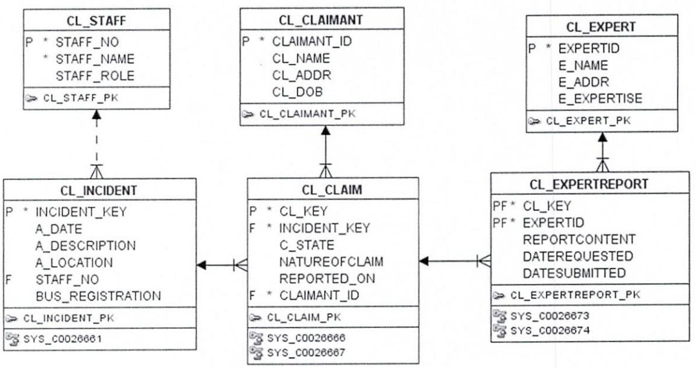

# TECHNOLOGICAL UNIVERSITY DUBLIN KEVIN STREET CAMPUS

BSc. (Honours) Degree in Computer Science (Infrastructure) BSc. (Honours) Degree in Computer Science BSc. (Honours) Degree in Computer Science (International) Year 3

SEMESTER 1 EXAMINATIONS 2019/20

### Databases 2

Ms. Patricia O'Byrne Dr. Deirdre Lillis Dr. David Malone - DT211C Dr. Martin Crane - DT228/DT282

Two Hours

Instructions to candidates:

Please read Case Study 1 carefully before answering any questions. Please answer question 1 and any two other questions. There is a syntax sheet at the end of the paper to assist you.

A company owns a fleet of buses on which it carries fare-paying passengers. On occasion, incidents occur that result in a claim. The company's claims section handles most of the claims. When an incident occurs, staff members are expected to report it, giving his or her staff number (staff no), name (staff name) and role (staff role) along with details of the incident (a date, a description, a location). If a bus is involved, its registration is also recorded (bus registration). An incident key (incident key) is generated at the time of recording.

Claimants can submit claims, giving the incident details (a date, a description, a location), their details (cl name, cl addr), date of birth (cl dob) and the nature of the claim (natureofclaim). A claim key (cl key) is generated at the time of recording. If the incident has not yet been reported by a member of staff, it is recorded with the claim and the claim state (c_state) is 'U' for unconfirmed. If a staff member confirms it, the state is updated to 'C' for confirmed and the staff no is added to the incident. While assessing the claim, the assessor may look for an expert report, creating the request (cl expertreport) giving the claim key (cl key) and picking an appropriate expert (expertid) from the experts table (cl expert). This action causes the claim state to change to 'E' for awaiting expert. When the expert has finished reviewing the claim, he / she updates the report, adding content (reportcontent)

and the date he / she submitted the report. If all expert reports on the claim have been submitted, the claim state (c state) reverts to 'C' for confirmed. When the claim is assessed its state can change to 'S' for settled or 'R' for rejected.

Case Study 1 Handling Insurance Claims

# Question 1 (compulsory)

#### [40 marks]

- Claimants can make claims by electronic means, but can only ever see data specific to them. 1. (a) The They cannot see incident details or details of other claims related to that incident. assessor can see everything, and can change the claim state and request expert reports. The expert can see details of the claimant, the claim and the incident and can submit reportcontent and datesubmitted for expert reports requested of them and change their own address. Other staff members can see their own details and incidents and can verify them, by entering their staff no.
Copy the table below into your examination script and using the information described in Case Study 1, fill in the boxes with permissions (S for select, I for insert, U for update) that (6 marks) each type of user has over the tables, using the principle of least privilege.

|  | Claimant | Assessor | | Expert | Other staff member |
| --- | --- | --- | --- |
| CL_CLAIM |  |  |  |
| CL_CLAIMANT |  |  |  |
| CL INCIDENT |  |  |  |
| CL_STAFF |  |  |  |
| CL_EXPERT |  |  |  |
| CL EXPERTREPORT |  |  |  |

- Write queries to do the following: (3x6 marks) (b)
(i) Write SQL to return a list of staff names (STAFF NAME) who are working as drivers (6 marks) (STAFF ROLE='Driver') who have never reported an incident. (ii) Write SQL to list the names of claimants (CL NAME) whose claims have been

(6 marks) investigated by a doctor (E Expertise is 'Medical').

(iii) Write SQL to list the expert name, expertid and e expertise of any expert that has (6 marks) submitted expert reports on more than ten claims.

- Write a function count claims(DOB) to take an input parameter of a date and return number (c) of claims made by claimants who were born on that date, including error and exception (10 marks) checking.
- Explain how this function could be called from a 3GL (like Python) in a safe and secure way, (d) noting security you would apply and the steps required in a 3GL to retrieve data from a (6 marks) relational database.

## Question 2

#### [30 marks]

- Evidence is stored in 2. The company has extended the amount of information they store. different electronic stores depending on what type of evidence it is - e.g. video evidence is always kept in the Video Store.
Incident Kev: In123

Incident Description: Low-speed collision between bus and car. Car passengers claim to suffer ongoing pain as a result. Car has some damage. Neither driver admits responsibility.

| Claim | Witness | Witness | Witness | Evidence | Evidence | Evidence | Evidence | Evidence |
| --- | --- | --- | --- | --- | --- | --- | --- | --- |
| Key | No | Name | Phone | Key | Type | Store | File | Description Video |
|  |  |  |  |  |  |  |  | footage of |
|  |  | Mary | 086 |  |  | Video |  | scene from |
| CL123 | 423 | O'Connell | 332211 | EV123 | Video | Store | V123.MP4 | GoPro. |
|  |  | Halligan's | (01) |  |  | Video |  | Video footage of |
| CL123 | ਟ83 | Deli | 44334 | EV124 | Video | Store | V134.MP4 | scene, CCTV. |
|  |  | Dr. H. | (01) |  |  | Medical |  | Med Report on J.K.'s |
| CL123 | 43 | Macken | 4455445 | EV125 | Medical | Reports | V125.pdf | injuries |
|  |  | Dr. H. | (01) |  |  | Medical |  | Med Report on M.K.'s |
| CL124 | 43 | Macken | 4455445 | EV126 | Medical | Reports | V126.pdf | injuries |
|  |  | Mike | (01) |  |  | Mechanic |  | Report on damage to |
| CL124 | 86 | Jones | 3322332 | EV127 | Mechanical | Store | V127.pdf | vehicle. |

Table 1 Progress report on claims arising from incident with key In123

| (a) Represent the information supplied in Table I in unnormalized form. | (5 marks) |
| --- | --- |
| Represent the information in first normal form. (b) | (5 marks) |
| Represent the information in second normal form. (c) | (5 marks) |
| (d) Represent the information in third normal form. | (5 marks) |
| Draw a fully normalized ERD to represent the entities derived by the normalization process, (e) |  |

showing primary and foreign keys, attributes and relationships.

(10 marks)

#### Question 3.

#### [30 marks]

- Using the ERD shown in Case Study 1, write SQL to create a view of the data that the 3. (a) assessor needs, when assessing a claim. The assessor should see claims where the incident has been confirmed, but not those that have been settled. He / She should see all claimant, claim and incident information, all details on staff members who have reported or confirmed the incident and expert reports that have been requested on the claim. Remember that not all (10 marks) claims have an expert report.
	- Design a MongoDB collection or set of collections that can hold information from the (b) following two incidents, observing the rule that every claim must have a claimant with contact details and an incident report, with a location. Write code to insert one of these incidents:
	- Incident A: happened on 20th Nov 2019, at the corner of North and Barrow Street, Latitude: 53° 21' N, Longitude: -6° 19' W. Involved Bus (reg 151 D 12345). Incident Report: "Bus pulled out and clipped the front wing of my car (192 D 1001)." Claim: Kenneth Lynch, DOB 12th Jan 1993, 23 Olive Grove, D55 is claiming for compensation for vehicle damage and replacement vehicle hire.
	- Incident B: Happened on 21st Nov 2019, on the 43 bus, 152 D 44332. "I was wearing a new pair of trousers and sat in the third row of seats in the bus. When I stood up there was chewing gum on my trousers. I told the driver and he said he'd noted it." Claim: "I, Simon McGlynn, 87B Johnsway House, Johnsway Lane, D99, born on 12th Apr 1974, am claiming for replacement value of the trousers. I enclose the receipt for the trousers (receipt.png)." Confirmation: Ted McBride (staff no 77321, driver) confirmed this incident on 22nd November. (10 marks)
	- (10 marks) (c) Discuss your preference for how this data should be stored, giving reasons.

# Question 4

### [30 marks]

- Assuming the data is stored in a relational database with the conceptual schema as shown in 4. the ERD in Case Study 1, write a PL/SQL program, complete with error checking, to add an extra claim against an existing incident, by an existing claimant, in the following steps:
	- Using substitution variables, accept a claimant id, an incident key and the nature of claim (a) (5 marks) (natureofclaim, a string).
	- Verify that the claimant has an existing claim for this incident, noting the state of the existing (b) claim. If there is no such claim, report this and exit without amending the data. (15 marks)
	- If the claimant has an existing claim for this incident, add a new claim, incrementing an (c) existing sequence called cl sequence and using the current date to populate the 'reported_on' attribute. If the existing claim has a state of 'U', the new claim should also have a state of (10 marks) 'U'. Otherwise, the new claim has a state of 'C'.

ogramme Code: DT211C, DT228, DT

ONGODB EXAMPLES
ate a products collect

createCollection("contacts",
alidator:{ $or:[
hone:{$type:"string"}},
mail: {$regex: /(@mydt\.ie$/)},
tatus:{$in:["Unknown","Incomple

a document with _id value 11
products collection:

d: 11, item: "pencil", qty: 50, .2" },
 item: "pen", qty: 20
 item: "eraser", qty: oroducts.insert

butes may contain embed

nbed_attrib_name>:[{set of embed_
attributes}]

SQL_BLOC

3CLARE
constant/variable declarat xecutable statemel
TURN Return vali
XCEPTION
ception handlers

VSQL FUNCTION
EATE [OR REPLACE] FUNCTI
[inction_function _rame
[parameter]) ]
ETURN return_datatype

execulable declaration_sectio
EGIN

SQL

ECT column-list FROM tablent
ERE condition]
DER BY column-list]
DER BY column-name]
VING condition]:

ELECT column-list FROM Joinpin-expression
in-expression (alle2 din-lied)
Tuble I VONG (collument (colori
table I UNIVE (colling Colling (color
table I UNIVE (colling (color 151 onditions : BETWEEN :. AND.., IN (I

SERT INTO tablenan
plumn-name,}]
LUES (data-value-lis

IATE tablename
IT column-name= <data-va
WHERE conditio

