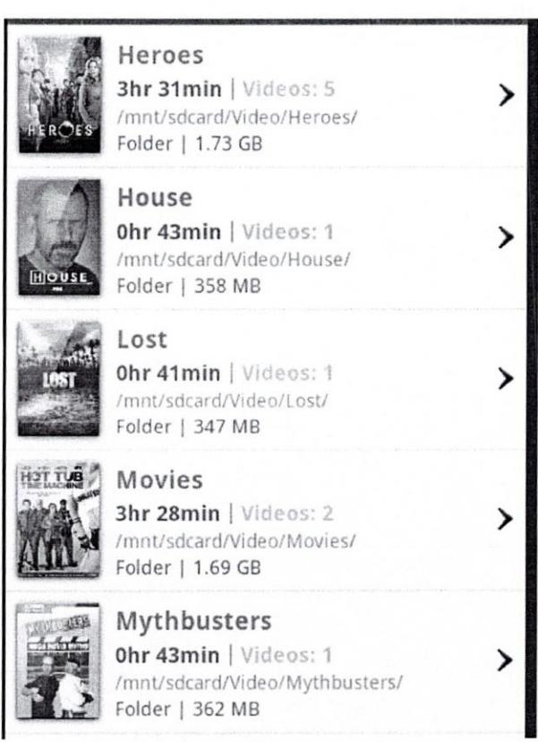

06.01.20

18.30 - 20.30pm

CMPU 3026 Mobile Software Development

Basement 1, Kevin Street

Programme Code: DT228 Module Code: CMPU 3026 CRN: 22413

# TECHNOLOGICAL UNIVERSITY DUBLIN

KEVIN STREET CAMPUS

BSc. (Honours) Degree in Computer Science

Year 3

SEWMESTER 1 EXAMINATIONS 2019/20

## Mobile Software Development

Dr. Susan McKeever Dr. Deirdre Lillis Mr. Patrick Clarke

Two Hours

#### INSTRUCTIONS TO CANDIDATES

QUESTION 1 IS COMPULSORY.

ANSWER QUESTION 1 AND TWO OF THE REMAINING THREE QUESTIONS

QUESTION 1 CARRIES 50 MARKS. ALL OTHER QUESTIONS CARRY 25 MARKS EACH.

- An Android app that will display a list of books is under development. The book Q1. (a) details are stored on a local SQLlite database. Answer the following in your own words:
	- Explain and describe the custom java classes and XML layouts you would (i) develop in order to deliver the book list display. Assume database functionality (10 marks) is in scope. State any assumptions you make.
	- (ii) Explain how compliant your suggested code structure is with the Model View (5 marks) Controller software architecture.

(Total 15 marks)

- Looking at the code snippet in Figure 1, answer the following, with explanation: (b)
	- What is the meaning of the Context parameter passed in to the constructor on (i) (2 marks) line 5?
	- (2 marks) What is the purpose of the getView ( ) method on line 12? (ii)
	- (2 marks) What is the purpose of a Layout Inflater class ? (iii)
	- Explain the reason for using (ImageView) with the findViewbyID (iv) (2 marks) method on line 17
	- (2 marks) What class does the inflate method on line 15 belong to? (v)
	- Why does the MySimpleArrayAdapter class inherit from the (vi) (2 marks) ArrayAdapter class?
	- (vii) What views are known to be in the associated row layout XML file, based on (3 marks) examining the code snippet?

(Total 15 marks)

|  | 1 public class MySimpleArrayAdapter extends ArrayAdapter<String> |
| --- | --- |
| 1 - 2 - 2 - 2 - | private final Context context; |
|  | private final String [ ] values; |
|  | public MySimpleArravAdapter(Context context, String[] values) { |
| င်္က များမွာ မေ | super (context, - 1, values) ; |
|  | this.context = context; |
|  | this.values = values; |
| g |  |
| 10 |  |
| II | @Override |
| 12 | public View getView (int position. View convertView, ViewGroup parent) { |
| 13 | LayoutInflater inflater = (LayoutInflater) context |
| 14 | .getSystemService (Context.LAYOUT INFLATER SERVICE) ; |
| 15 | View rowView = inflater . inflate (R. layout . rowlayout, parent, false) ; |
| 16 | TextView textView = (TextView) rowView.findViewById(R.id.label) ; |
| 17 | ImageView imageView = (ImageView) rowView.findViewById(R.id.icon) ; |
| 18 | textView.setText (values [position] ) ; |
| 19 | String s = values [position] ; |
| 20 | if (s.startswith ("i") ) { |
| 21 | imageView.setImageResource (R.drawable.no) ; |
| 22 | } else { |
| 53 | imageView.setImageResource(R.drawable.ok) ; |
| 24 |  |
| 25 |  |
| 26 | return rowView; |
| 27 |  |

### Figure 1 Code snippet

#### Q1 Continued

Answer the following: (c)

> (i) What user interface component does the code below represent? (2 marks)

> (ii) What is the purpose of the completionThreshold attribute? (3 marks)

<AutoCompleteTextView android:id="(@)+id/edit" android:layout width="fill parent" android:layout height="wrap content" android:completionThreshold="3"/>

(Total 5 marks)

Explain the purpose and usage of LogCat in Android app development. (d)

(5 marks)

A company wants to make their services available to their customers via mobile (e) phone. Explain any four factors the company should consider when making these implementation choices:

(i) Native app versus mobile enabled website (5 marks)

(ii) Native app versus hybrid app (5 marks)

(10 marks)

(Q1 total 50 marks)

Q2. (a) Describe a sample scenario where the AsynchTask class is useful in an Android app.

(5 marks)

(b) What is the relationship between the life cycle of an AsynchTask and its associated Activity? What problems can this result in?

(10 marks)

Explain the role of JavaScript Object Notation (JSON) in an Android app that uses (c) cloud data storage.

(5 marks)

A developer is creating an app that will allow landlords to add rental properties, and (d) allow renters to search for properties to rent. Explain what data storage option(s) you would suggest, in terms of data to be stored on the local phone versus cloud storage. (5 marks)

(Q2 total 25 marks)

Q3. Explain any four approaches available in the Android platform for catering for (a) different user phone screen sizes.

(10 marks)

(b) The variety of devices and screen sizes is a particular challenge for Android development compared to app development for iPhone. Explain why this issue exists for the Android platform.

(5 marks)

(c) An Android developer has created a project in Android Studio, and notices that the new activity class extends AppCompatActivity. What is the AppCompatActivity class and why is it used?

(5 marks)

(d) Explain the concept of "Launcher" as used in this Android Manifest xml file extract:

<activity android:name=".MainActivity" android:label="@string/app name"> <intent-filter> <action android:name="android.intent.action.MAIN" /> <category android:name="android.intent.category.LAUNCHER" /> </intent-filter> </activity>

(5 marks)

(Q3 total 25 marks)

Describe the layout(s) and views you would use to achieve the row layout of the list Q4. (a) shown in Figure 2.

(5 marks)

Explain in your own words what code should be implemented so that when a row in (b) the list shown in Figure 2 is clicked, another screen is displayed. This new screen will display the details of the clicked row. Include both the click functionality in the list activity and the related processing in the new activity in your answer.

(10 marks)

Explain how the Android lifecycle methods can be used to reduce battery load in a (c) Location tracking app when the app is open but inactive.

(5 marks)

(Q4 continued)

- (d) An Android developer has set a minTime of 3 milliseconds, and a minDistance of 2 metres. Explain how each of these two parameters will impact the triggering of the onLocationChanged event handler.
(5 marks)

(Q4 total 25 marks)

FIGURE2: ROW LAYOUT

