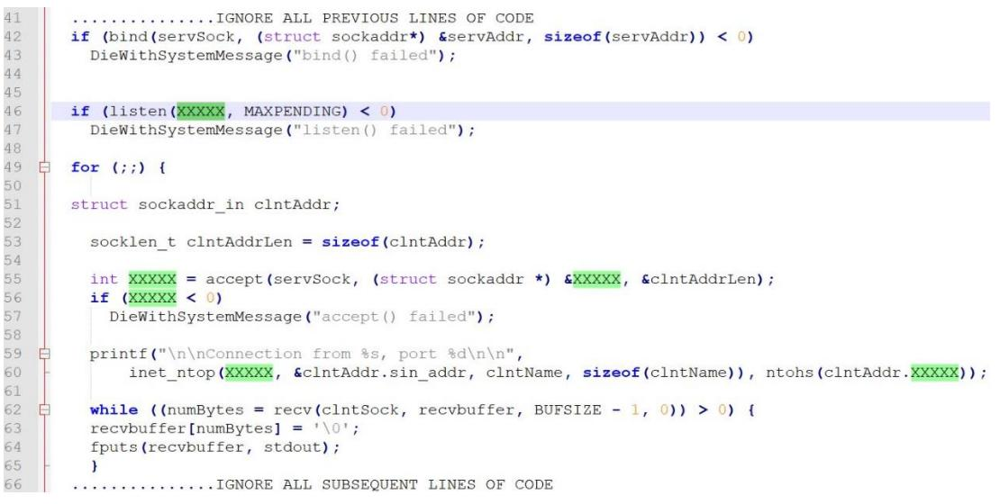
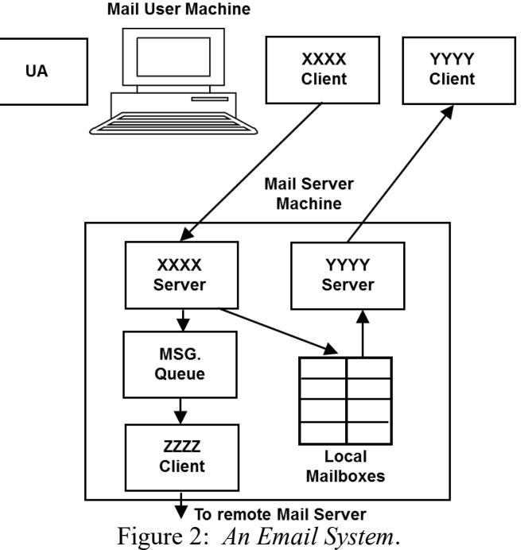
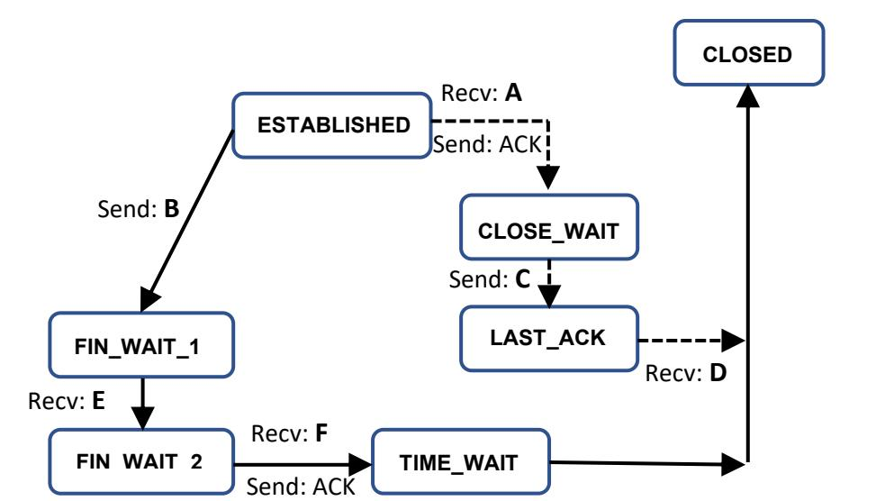

Module Code: CMPU3006

# **TECHNOLOGICAL UNIVERSITY DUBLIN**

**Grangegorman**

**_____________**

TU856 BSc. (Honours) Degree in Computer Science

## TU858 BSc. (Honours) Degree in Computer Science (International)

**Year 3**

SEMESTER 1 EXAMINATIONS 2022/23

**______________**

**______________**

**CMPU3006, Client Server Programming**

Internal Examiner: Mr. Damian Bourke

Dr. Paul Doyle

External Examiner: Ms. Sanita Tifenale

## *Attempt Question 1 and three of the four remaining questions. All questions carry equal marks.*

*Duration: 2 hours.*

- 1. Refer to Figure 1 (A snippet of code) and the following list of terms:
0 (the number zero), INADDR_ANY, MAXPENDING, IPPROTO_TCP, clntAddr, SOCK_STREAM , clntSock, htons, inet_pton, AF_INET, atoi, sin_port, servSock.

Figure 1: A snippet of code. (i) Using line numbers, identify which XXXXX value can be replaced with which term from the above list.

(12 marks)

- **(ii)** State whether this is a client or server application justifying your answer.
(3 marks)

- **(iii)** Explain the role of the two functions: *inet_ntop()* and *ntohs()*, identified in line 60. In your answer explain the concept of *byte order* with respect to the TCP and Application layers, identifying the byte order used within each layer.
(10 marks)

- 2. The following string representing an **incorrectly** formatted HTTP/1.1 Request message for the default homepage is sent to the TU Dublin webserver:
### **GET /HTTP/1.1 \r\nConnection-closed\r\n**

- (i) There are five errors associated with this string; four of which relate to syntax and one relating to an omitted compulsory data element. Rewrite the HTTP Request in its proper form.
(5 marks)

- **(ii)** Assume the **properly** formatted HTTP GET Request from (i) above is sent to a HTTP server, explain the origins of the problem associated with the use of the following implementation of the *recv()* primitive becoming 'stuck' inside the *while()* loop and, explain how this problem might usefully be addressed.
#### **while ((numBytes = recv(clntSock, recvbuffer, BUFSIZE - 1, 0)) > 0)**

 { **recvbuffer[numBytes] = '\0'; //this line is not important fputs(recvbuffer, stdout); //this line is not important**

 }  **if (numBytes < 0) DieWithSystemMessage("recv() failed");**

(10 marks)

- **(iii)** Given that the HTTP **Response** message will likely include a Body section and consequently the solution to the problem associated with *recv()* primitive outlined in (ii) above will not work efficiently, identify the appropriate HTTP Header that should be returned to assist the client in addressing this problem and, outline a high-level solution to the problem that uses this Header value (code not required).
(10 marks)

- 3. In relation to the *accept()* primitive:
	- (i) Explain the purpose of this primitive and identify which side calls this primitive, *client* or *server*.

(5 marks)

- **(ii)** The primitive returns an additional connected socket identifier. Explain the purpose of this new socket and explain how it differs from the existing socket in terms of its use.
(8 marks)

- **(iii)** Given the following addressing information, identify the *socket pairs* that include the original and new sockets as viewed from the *server* host and separately identify the *socket pair* for any open connection as viewed from the *client* host: Client IP address/Port number: 192.168.1.11/1050, Server IP address/Port number: 192.168.1.12/80.
(12 marks)

- 4. Refer to Figure 2 *An Email System*.
	- (i) Identify each of the Client-Server components labelled XXXX and YYYY and the Client component marked ZZZZ.

(6 marks)

- **(ii)** Explain the role of each of the following components: XXXX Client/Server, YYYY Client/Server and User Agent.
(9 marks)

- **(iii)** Identify the protocols used by the XXXX and YYYY Client/Server components and the ZZZZ Client component and, identify which would be associated with the following interaction:
HELO localhost MAIL FROM: <joe.bloggs@google.com> RCPT TO: <mary.jane@tudublin.ie> DATA

(10 marks)

- 5. Refer to Figure 3 *TCP State Transitions*. This figure shows TCP state transitions for applications performing *active and passive* connection terminations.
	- (i) Identify which transitions, dashed or solid lines, relate to the *active* and *passive* connection termination sequences.

(5 marks)

- **(ii)** Choose the appropriate messages from the following list: SYN, ACK and FIN, that correspond to the six missing TCP messages (labelled A - F) enabling movement from one state to another during the termination process.
(12 marks)

- **(iii)** Explain the sequence of events that would occur if the final ACK in the termination sequence is 'lost' and explain the significance of the TIME_WAIT state in this regard. (8 marks)

Figure 3 – *TCP State Transitions*.

