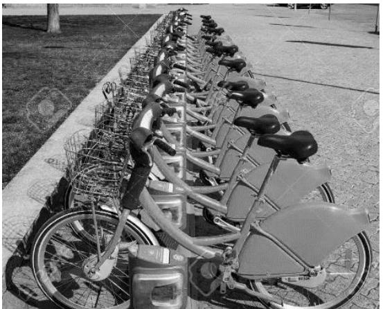
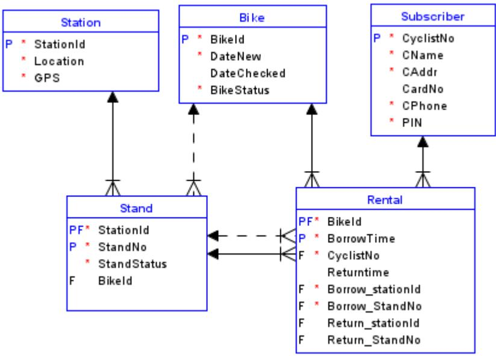

*Programme Code: TU856, TU857, TU858, DT844 Module Code: CMPU3010*

# **TECHNOLOGICAL UNIVERSITY DUBLIN**

**Grangegorman** 

**_____________** 

# TU856 B.Sc. (Hons) Computer Science TU857 B.Sc. (Hons) Computer Science (Infrastructure) TU858 B.Sc (Hons) Computer Science International DT844 Erasmus

*Year 3 ______________* 

*SEMESTER 1 EXAMINATIONS 2022/23*  **______________** 

# *CMPU3010 Databases 2*

**Internal Examiner(s):**  Dr. Patricia O'Byrne Dr. Paul Doyle **External Examiner(s):** Ms. Pamela O'Brien Ms. Caroline McEnroy

# **Instructions To Candidates:**

*Answer Question 1 (40%) and two others (30% each). Read the case study on page 2 before attempting questions. There is a syntax table on the last page to assist you.*

**Exam Duration: 2 hours**

**Special Instructions /Handouts/ Materials Required:**

*There is a syntax table on the last page to assist you.*

# *City Bikes Case Study Description*

A European City has a bicycle rental scheme. Bicycle stations are distributed at locations around the city. Each station has multiple bike stands. **Cyclists** who have subscribed can borrow a bike from one station, cycle to another station and return it. To subscribe to the service, the cyclist must provide a credit card number, name, address, and phone number. A 4-digit personal identification number (PIN) and a CyclistNo are allocated to the new subscriber.

Stations are identified by station Id and have a location and GPS code. There are numbered stands at each station. Each stand can hold one bike. The status of a stand (standstatus) denotes whether it is functioning ('F') or damaged ('D'). Each bike has an identifying serial number (bikeId), a date of purchase and a status (bikestatus), with a value of 'R' (ready to be deployed), 'M' (being maintained), 'D' (deployed), 'C' for check (a cyclist has reported a problem) or 'X' (expired).

To borrow a bike, the cyclist goes to a station and enters their cyclistno, PIN and stand number. The system releases the bike from the stand, clearing the bikeId attribute in the stand, and recording a new rental. Cyclists can view their own rental history.

To return a bike, the cyclist locks the bike into an empty stand. This causes the rental to terminate, recording the ReturnTime and allocating the BikeId to the stand.

**Drivers** monitor the stations and move bikes from full to empty stations. The drivers check bikes with status = 'C' and may remove bikes for maintenance, changing bike status to 'M'. The driver can change the status of damaged stands to 'D'.

**Mechanics** fix bikes and stands and update the status of both. If a bike is beyond repair, the mechanic marks its status as 'X'. When a stand has been fixed, the mechanic returns its status to 'F'.

**Managers** monitor rentals and repairs and replace bikes where necessary, adding new bikes and removing those with a status of 'X'. If a problem is reported, a manager can set the bike status to 'C' or the stand status to 'D'. Managers also add and remove stations, stands and bikes.

### **Figure 1 Entity Relationship Diagram for City Bikes**

## **Question 1 (compulsory) [40 marks]**

- 1. (a) Users of the City Bikes system are listed as column headers in Table 1. Copy the table into your answer book and fill the boxes with permissions (S for select, I for insert, U for update) that each type of user should have, using the description in *City Bikes Case Study Description*, using the principle of least privilege. (8 **marks)**

|  | Cyclist | Driver | Mechanic | Manager |
| --- | --- | --- | --- | --- |
| STATION |  |  |  |  |
| BIKE |  |  |  |  |
| SUBSCRIBER |  |  |  |  |
| STAND |  |  |  |  |
| RENTAL |  |  |  |  |

Table 1 User privileges

*[Continued on next page]*

- 1. (b) Write queries to do the following: (3x6 marks)
(i) Write SQL to return a list of each bike and the number of times it has been rented, including bikes that have never been rented. **(6 marks)**

(ii) Write SQL to list the rental history (i.e. all rentals) of bikes that have a status of 'X'.

**(6 marks)**

(iii) Write SQL to list stations where all stands are full (i.e. the bikeId is not null). **(6 marks)**

- (c) Write a PLpgSQL function and trigger to prevent a cyclist from renting a bicycle if the cyclist has a previous rental that has not been returned. **(14 marks)**
# **Question 2 [30 marks]**

- 2. City Bikes employs mechanics to keep the bikes in good working order and looking well. When a mechanic has worked on a bike, he / she records the hours worked on a bike on a date, giving a description of what was done and the outcome of the repair. When bike faults are reported, they are categorized by fault type – e.g. 'Elec'. Each fault type has a type description. In addition to this, the specific fault has a description. Using a copy of the weekly maintenance report, as shown in Table 2 (see next page), do the following:

| (a) | Represent the data in unnormalized form. | (6 marks) |
| --- | --- | --- |
| (b) | Represent the date in First Normal Form. | (6 marks) |
| (c) | Represent the data in Second Normal Form. | (6 marks) |
| (d) | Represent the data in Third Normal Form. | (6 marks) |
| (e) | Draw a fully normalized ERD to represent the entities derived by the normalization process, |  |
|  | showing primary and foreign keys, attributes and relationships. | (6 marks) |

|  |  | Fault |  |  |  |  |  |  |  |  |  |
| --- | --- | --- | --- | --- | --- | --- | --- | --- | --- | --- | --- |
|  |  | Reported | Fault | Type | Fault | Date | Hours | Mechanic | Mechanic | Mechanic's |  |
| BikeId | DateNew | Date | Type | Description | Description | examined | spent Id |  | Name | comment | Outcome |
|  |  |  |  |  |  |  |  |  |  | Thermal |  |
|  |  |  |  |  | Frame |  |  |  |  | treatment |  |
|  |  |  |  |  | damaged after |  |  |  | John | and |  |
| 5003 | 10/02/2022 | 02/11/2022 | Body | Frame | collision | 03/11/2022 | 2.00 | 5443 | Gormley | reshape | In Progress |
|  |  |  |  |  |  |  |  |  | Martin |  |  |
|  |  |  |  |  |  | 04/11/2022 | 1.50 | 4990 | O'Neill | Resprayed | In Progress |
|  |  |  |  |  |  |  |  |  | Martin | Logo stencil |  |
|  |  |  |  |  |  | 05/11/2022 | 0.50 | 4900 | O'Neill | applied | Ready |
|  |  |  |  |  | Bike battery |  |  |  |  |  |  |
|  |  |  |  |  | box damaged |  |  |  |  |  |  |
|  |  |  |  |  | - battery not |  |  |  |  |  |  |
|  |  |  |  | Electric | making |  |  |  | John | Reshaped |  |
| 2000 | 25/01/2019 | 03/11/2022 | Elec | failure | contact | 04/11/2022 | 4.00 | 5443 | Gormley | battery box | In Progress |
|  |  |  |  |  |  |  |  |  |  | Refitted |  |
|  |  |  |  |  |  |  |  |  | Maria | electronics |  |
|  |  |  |  |  |  | 05/11/2022 | 1.00 | 5833 | Nolan | and tested | Ready |
|  |  |  |  |  | Frame |  |  |  |  | Not |  |
|  |  |  |  |  | completely |  |  |  | John | salvageable |  |
| 5003 | 10/02/2022 | 03/11/2022 | Body | Frame | destroyed | 04/11/2022 | 0.50 | 5443 | Gormley | - expired | Expired |
|  |  |  |  |  | Needs |  |  |  | Martin |  |  |
| 1040 | 01/04/2015 | 03/11/2022 | Aesthetic | Paint work | repainting | 04/11/2022 | 1.50 | 4990 | O'Neill | Resprayed | In Progress |
|  |  |  |  |  |  |  |  |  | Martin | Logo stencil |  |
|  |  |  |  |  |  | 05/11/2022 | 0.50 | 4900 | O'Neill | applied | Ready |

# Weekly Maintenance work Report

**Table 2 Weekly Maintenance Report.**

### **Question 3 [30 marks]**

| UserId 44, 22/11/2022: (Id 4001) I borrowed on 21st November 2022 from Parnell Street, stand |
| --- |
| 3, had grease spilt on it. It was too dirty to use, so I put it back.' |
| UserId 18, 28/11/2022: 'The electric option on Bike Id 2990 isn't working, even though my |
| battery is showing a green light'. |
| UserId 440, 12/12/2022: 'There are never any free slots at Heuston Station at 6pm. I missed my |
| train trying to park my rental bike.' |
| UserId 203, 22/12/2022: 'Two of the stands in Parnell Street aren't locking the bikes'. |

### **Table 3 Sample Customer Complaints**

- 3. Due to a rising number of customer queries and complaints, City Bikes has decided to introduce a formal customer communication system. Some of the communications give full details, giving the bike id, station and stand, and details of a problem with either the bike or stand. Some are reporting a fault with a specific stand, or a failing of the station – i.e. there are too many / too few bikes at the stand. Some give a message without any specifics.
	- (a) Create a MongoDB collection that would allow the user to enter any of the communications in

Table 3, ensuring that every communication has a cyclistno and date. (5 **marks)**

- (b) Write code to insert the first row from Table 3 into your new collection. (5 **marks)**
- (c) Extend the ERD shown in Figure 1, to accommodate the new communications, ensuring that your new table or tables are fully normalized. **(10 marks)**
- (d) Discuss your preference for how this data should be stored, giving reasons. **(10 marks)**

*[Question 4 on next page]*

### **Question 4 [30 marks]**

4. From the description in *City Bikes Case Study Description*, bike rental is describes as *"To borrow a bike, the cyclist goes to a station and enters their cyclistno, PIN and stand number. The system releases the bike from the stand, clearing the bikeId attribute in the stand, and recording a new rental".*

- (a) Assuming the data is stored in a relational database with the conceptual schema as shown in the ERD in Figure 1, write a PLpgSQL procedure, complete with error checking, to borrow a bike, using the following steps:
	- 1. Take in the subscriber's UserId, PIN, stationId and standNo.
	- 2. Check that the stand exists and currently holds a bike, exiting if this is not true.
	- 3. Check that the subscriber with this cyclistno exists and has this PIN, exiting if this is not true.
	- 4. Add a new rental, setting the borrowTime to the current time (NOW()).
	- 5. Remove the bikeid from the stand. **(30 marks)**

*Marks will be allocated for forming parameter passing correctly (6 marks), using appropriate SQL statements (6), handling errors correctly (6), general overall logic (12)*

# END OF PAPER

*See final page for syntax assistance*

### SQL

*SELECT column-list FROM tablename [join-expression] [WHERE condition*] *[ORDER BY column-list] [GROUP BY column-name] [HAVING condition]; Join-expression = table1 [left / right] JOIN table2 ON condition | USING (column-list) Conditions : =,>,<,>=,<=,<>, BETWEEN .. AND.., IN (list), IS NULL, LIKE, EXISTS Logical operators: AND, OR, NOT Set operations: UNION, INTERSECT, EXCEPT*

*INSERT INTO tablename [{column-name,}] VALUES (data-value-list) UPDATE tablename [SET column-name= <data-value>] [WHERE condition*]

### P**LPGSQL FUNCTION**

*CREATE [OR REPLACE] FUNCTION function-name (parameter-list) RETURNS <return-type> as $$ [ DECLARE [constant/variable declarations]] BEGIN Executable statements RETURN Return value [EXCEPTION exception handlers]* END;$$

# P**LPGSQL TRIGGER**

*CREATE TRIGGER triggername [BEFORE / AFTER] operation ON tablename FOR EACH ROW EXECUTE FUNCTION function-name;*

## P**LPGSQL PROCEDURE**

*CREATE [OR REPLACE] PROCEDURE procedure-name as $$ [ DECLARE [constant/variable declarations]] BEGIN Executable statements [EXCEPTION exception handlers]* END; $$ Parameters must have a name and a data type but may be optional (DEFAULT NULL).

### M**ONGO**DB **EXAMPLES**

*Create a products collection:* db.createCollection("contacts", { validator:{ $or:[ {phone:{$type:"string"}}, {email: {$regex: /@mytudublinproduct\.ie$/}}, {status:{$in:["Unknown","Incomplete"]}} ] }}} *Insert an order into the productOrders collection ordering 3 items:* db.productOrders.insertOne({ OrderNo:1, OrderDate: new ISODate("2022-04-21"), items: [ { item: "pencil", qty: 50, type: "no.2" }, { item: "pen", qty: 20 }, { item: "eraser", qty: 25 } ]}) Attributes may be embedded docs or arrays.

