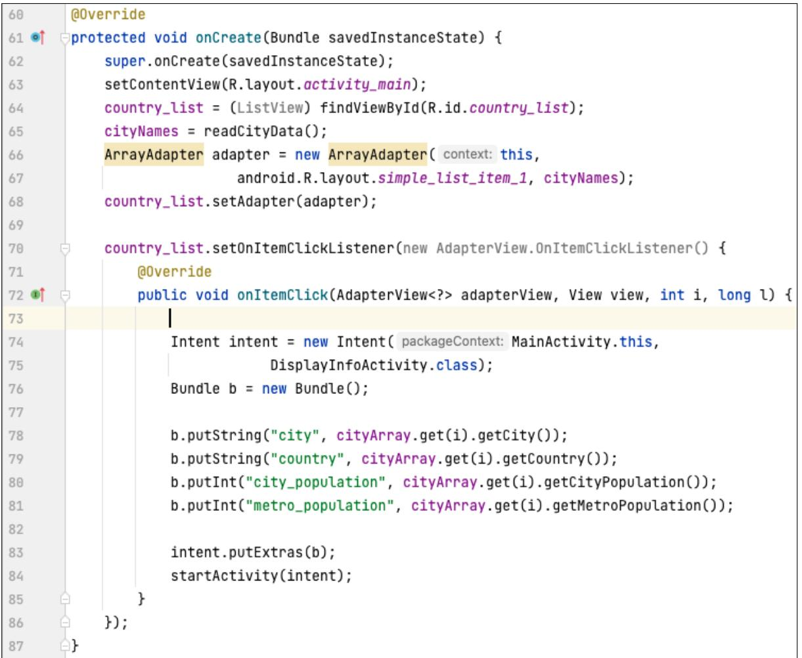

## TECHNOLOGICAL UNIVERSITY DUBLIN Grangegorman

TU857 BSc. (Honours) Degree in Computer Science (Infrastructure)

TU858 BSc. (Honours) Degree in Computer Science (International)

Year 3

SEMESTER 1 EXAMINATIONS 2022/23

**CMPU3026** Mobile Software Development

Internal Examiners Dr. Paul Doyle Dr. Luis Miralles

External Examiners Ms. Pamela O'Brien Ms. Caroline McEnroy

Two Hours

Instructions to candidates 

Answer ALL Questions. Answer three parts in Questions 1.

- 1. Answer three out of the following four parts:
	- (a) Explain the purpose of the manifest file component in android and its relationship with Gradle.

(10 marks)

- (b) Explain the purpose of the "Intent" object and the difference between the implicit and the explicit intents.
(10 marks)

- (c) Discuss why AsyncTask is currently deprecated in Android and describe two alternative solutions for running a parallel activity in the background to prevent overloading the main activity.
(10 marks)

- (d) Callbacks functions are used in different scenarios. For example, when a user clicks a button. Discuss what a callback function is and explain the three ways we have seen they can be implemented in Android.
(10 marks)

- 2. Answer the following three parts:
	- (a) In relation to the Android Activity cycle, discuss how would you implement the functions "onSaveInstanceState (Bundle outState)" and "onRestoreInstanceState (Bundle savedInstanceState)" and explain the purpose of the parameter "savedInstanceState" in lines 60 and 61.

|  | @Override |
| --- | --- |
| 60 0 | protected void onCreate(Bundle savedInstanceState) { |
| 61 | super.onCreate(savedInstanceState); |
| 62 | setContentView(R.layout.activity_main); |
| 63 | country_list = (ListView) findViewById(R.id.country_list); |
| 64 |  |
| 65 |  |

(10 marks)

- (b) Compare and contrast the main three ways of storing information in Android (Files, Databases, and Cloud storage) considering under which context would you recommend each of them.
(10 marks)

- (c) Explain the process of displaying a list of 1,000 elements stored on a database on an android activity screen using Room database (discuss whether you will use a Recyclerview or a Listview).
(10 marks)

- 3. Answer the following three questions:
	- (a) Explain the GPS parameters "minTime" and "minDistance", their relationship with the "onLocationChanged" event handler, and how their setting affects the battery.

(10 marks)

- (b) Discuss the advantages of Volley compared to using SQLite directly.
(10 marks)

- (c) Answer the following questions about the following code:
	- 1. Explain what the instruction "super.onCreate(savedInstanceState);" in line 62 does (3 marks).
	- 2. Explain what does the instruction "setContentView (R.layout.activity_main);" in line 63 do (3 marks).
	- 3. Explain what does the instruction "country_list = (ListView) findView-ById (R.id.country_list);" in line 64 do (3 marks).
	- 4. Explain what does the instruction "ArrayAdapter adapter = new ArrayAdapter (this, android.R.layout.simple_list_item_1, cityNames);" in line 66 do (3 marks).
	- 5. Explain what does the instruction "Intent intent = new Intent (MainActivity.this, DisplayInfoActivity.class);" in line 74 do (3 marks).
	- 6. Explain what the instructions "Bundle b = new Bundle();" and "b.putString ("city", cityArray.get(i).getCity());" in lines 76 and 78 do (3 marks).
	- 7. Explain what the instructions "intent.putExtras(b);" and "startActivity (intent);" in lines 83 and 84 do and indicate whether it is an explicit or an implicit intent (2 marks).

(20 marks)

