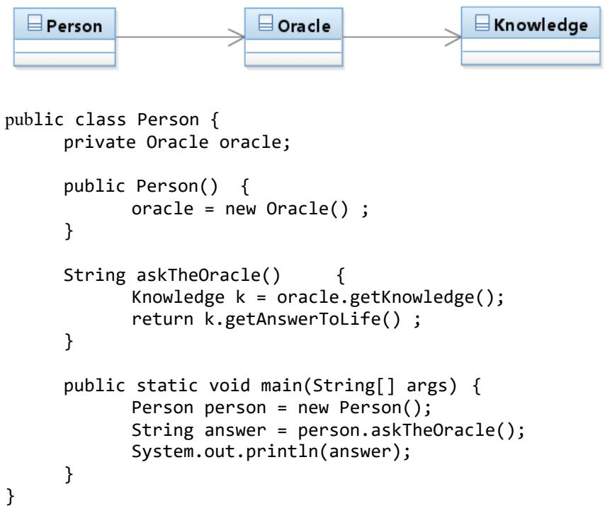

 *Programme Code: TU856 Module Code: CMPU 3038*

## **TECHNOLOGICAL UNIVERSITY DUBLIN**

**Grangegorman**

**_____________**

TU856 - BSc. (Honours) Degree in Computer Science

*Year 3 ______________*

*SEMESTER 1 EXAMINATIONS 2022/23* **______________**

## *CMPU 3038 Software Engineering 3*

**Internal Examiner(s):** Mr. Ciaran Cawley Dr. Paul Doyle

**External Examiner(s):** Ms. Pamela O'Brien

**Instructions To Candidates:** Answer *three* **out of four** questions. All questions carry 33 marks each. One complimentary mark shall be awarded.

**Exam Duration: 2 hours**

## **Special Instructions /Handouts/ Materials Required:**

If asked in any question to provide an example of code, you may use any appropriate language of your choice or pseudo code in your answer.

- Q.1 (a) Within the context of an *object-oriented* domain model, *associations* are defined between classes. Briefly explain, using an example of your choice, why an *association* would be defined between two classes.
(5 marks)

- (b) Explain how an *association* is related to:
	- (i) *Links* between objects.
	- **(ii)** *Messages* between objects in a sequence diagram.

(8 marks)

- (c) State the four guidelines of the *Principle of Least Knowledge*
(4 marks)

Consider the diagram below. It defines three classes and two associations. The code below the diagram implements a scenario where a Person object requires the data stored in a Knowledge object which can be accessed through a getAnswerToLife() operation on the Knowledge object.



- (i) Draw a sequence diagram that illustrates the sequence of messages starting at person.askTheOracle().
- (7 marks) **(ii)** Within the context of the *Principle of Least Knowledge* identify a potential issue that you see with the sequence diagram.
- (2 marks) **(iii)** Draw a new sequence diagram that would address the issue and explain why it does so.

(7 marks)

## Q.2 (a)Within the context of *object-oriented* structural design, define the term *Interface.*

(3 marks)

(b)When designing a software system, two modelling requirements may arise:

- (i) A class may be required to present more than one external interface to other collaborating classes.
- **(ii)** Several classes may be required to present the same interface.

*For each* of the above, describe, using an example of your choice how an *Interface Class* can be used to provide a solution to this requirement.

(2 x 10 marks)

- (c) Using a structural *Wrapper* design pattern of your choice, describe, illustrating your answer with a UML diagram, how and why an *Interface* is used as part of the solution. In your answer, ensure you explain what the *intent* of the design pattern is and its solution.
(10 marks)

- Q.3 (a) The web server/container code example provided below shows a solution to handling a *http client request*. The explicit client request is contained in the *"action"* parameter sent from the client. Within this solution, there are several design patterns evident. Three of those are the *Front Controller, Factory and Command*.
Discuss *each of the three* design patterns using the following headings:

- (a) Intent give a brief description of what the pattern provides.
- [2 marks] (b) Problem - provide a brief elaboration of the general challenge that this pattern addresses.
- [3 marks] (c) Solution - using the context provided by the code example, explain how it provides a solution to the problem.

[6 marks]

/**

* Common method to process all client requests (GET and POST) */

private void processRequest(HttpServletRequest request, HttpServletResponse response) {

```
String forwardToView = null;
String action = request.getParameter("action");
```
CommandFactory factory = CommandFactory.getInstance(); Command command = null;

try {

```
command = factory.createCommand(action);
      forwardToView = command.execute(request, response);
} catch (CommandCreationException e) {
      e.printStackTrace();
      forwardToView = "/errorPage.jsp";
}
```
}

forwardToPage(request, response, forwardToView);

- Q.4 (a) (i) State the *Intent* of the *Data Access Object (DAO)* design pattern.
- **(ii)** Provide a class diagram that communicates the high-level structure it provides. (6 marks)
- **(iii)** Using an example of your choice, provide the code for a typical DAO *interface*.

(5 marks)

- (b) As part of an implementation of the DAO that utilises a relational database, a mechanism is required to map the objects that exist in the system to the database.
	- (i) Briefly describe two main issues that present a mismatch between the object domain and the relational data domain.

(4 marks)

- **(ii)** Given the following class diagram, describe *three* different ways in which the classes could be mapped to a relational database. For *each of the three* ways, provide one advantage and one disadvantage that it provides.

|  | Booking |  |
| --- | --- | --- |
|  | Ca bookingNumber |  |
| Ca date |  |  |
| Ca time |  |  |
| Walk-In |  | Reservation |
| arrivalTime |  | specialRequest |

(12 marks)

- **(iii)** For one of the approaches that you provided for *part (ii)* of this question, describe any change/addition you would make to the mapping given the modified class diagram below.

| Booking | bookingNumber |  |  |  |  |  |
| --- | --- | --- | --- | --- | --- | --- |
| date | time |  |  |  |  |  |
| Customer | Walk-In | Reservation | - reservation | specialRequest | arrivalTime | contactNumber |
| 1 | א | 1 | contactName |  |  |  |
| - customer |  |  |  |  |  |  |

(3 marks)

