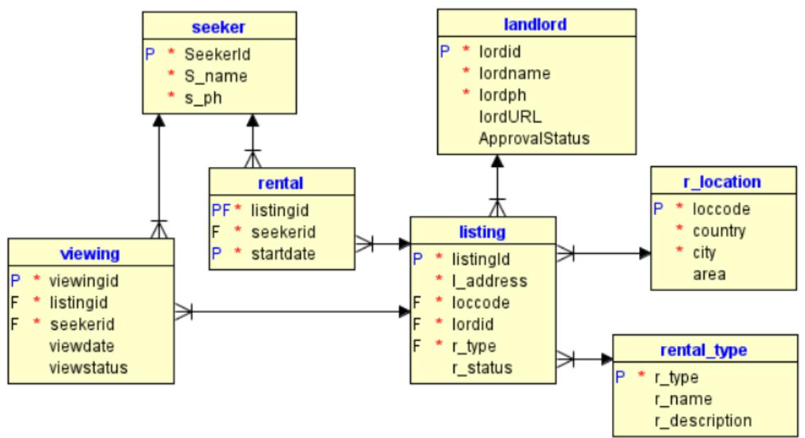

# **TECHNOLOGICAL UNIVERSITY DUBLIN**

**CITY CAMPUS - GRANGEGORMAN** 

**_____________**

# TU856 – B.Sc.(Hons) Computer Science TU857 – B.Sc.(Hons) Computer Science (Infrastructure) TU858 – B.Sc.(Hons) Computer Science International

*Year* 3 *______________*

*SEMESTER 1 EXAMINATIONS 2023/24* **______________**

## *CMPU 3010 Databases 2*

**Internal Examiner(s):**  Dr. Patricia O'Byrne Dr. Paul Doyle **External Examiner(s):** Ms. Pamela O'Brien Ms. Caroline McEnroy

**Exam Duration: 2 hours**

#### **Instructions to Candidates:**

*Answer Question 1 (40%) and* two *others (30% each). Read the case study on page 2 before attempting questions. There is a syntax table on the last page to assist you.*

## *Rent A Home Case Study Description*

### **Case Study ERD 1 Rent-a-Home**

Rent-a-Home is an online business that facilitates the rental of domestic homes. Listings show the property, its general location (i.e. an area, such as Dublin 7), the type of property (e.g. apartment, studio, bedroom) and the landlord's details. When a property is available for rent, it has a rental status (r_status) of 'F' for Free. If rented, it has a rental status of 'R' for rented. Only free properties are made visible. **Landlords** register with Rent-a-Home, with an initial ApprovalStatus of 'P' for pending. They may have their own website (lordURL), with images and further details of their properties, but neither the landlord nor their listings will be made visible on Rent-a-Home's site until they have been approved (ApprovalStatus= 'A'). Discredited landlords have an approvalStatus of 'X' and their properties are not visible. Landlords can register their properties for listing themselves. If they want a new location or rental type added, they must contact Rent-a-Home so the manager can add locations or rental types. The landlord can directly update viewings and add rentals.

**Seekers** can register on the Rent-a-Home site, giving their name and phone number. They can browse listed properties. If a seeker wishes to view a listed property, they can add a viewing, with an initial viewstatus of 'P' for pending and a null viewdate.

**Agents** who show the properties update any pending viewings, adding a viewdate and changing the viewstatus to 'A' for arranged. When the viewing is complete, they change the viewstatus to 'C'. **Managers** approve landlords and add rental types (r_type) and locations (loccode).

**Case Study 1 Description of Rent-a-Home**

### **Question 1 (compulsory) [40 marks]**

- 1. (a) Users of the Rent-a-Home system are listed as column headers in Table 1. Copy the table into your answer book and fill the boxes with permissions (S for select, I for insert, U for update) that each type of user should have, using the description in Case Study 1 Description of Renta-Home, using the principle of least privilege. (6 **marks)**

|  | Landlord | Seeker | Manager | Agent |
| --- | --- | --- | --- | --- |
| Seeker |  |  |  |  |
| Landlord |  |  |  |  |
| Listing |  |  |  |  |
| R_location |  |  |  |  |
| Rental_type |  |  |  |  |
| Rental |  |  |  |  |
| Viewing |  |  |  |  |

#### Table 1 User privileges

- (b) Write queries to do the following: (3x6 marks)
(i) Write SQL to return each listing (l_address, area, lordname, r_type) that should be visible (read Case Study 1 description) for rent in the city named 'Dublin'. **(6 marks)**

(ii) Write SQL to list the rentals each landlord has, giving the listing address (l_address), seeker name (s_name), landlord's name (lordname), the start date of the rental (startdate) and the rank of this rental, ordered by startdate, for this landlord. **(6 marks)**

(iii) Write **efficient** SQL to list locations (country, city, area) that have no properties listed for rental. **(6 marks)**

- (c) Write a PLpgSQL trigger to remove all properties not currently rented (r_status = 'R'), and the viewings associated with those properties for landlords with an ApprovalStatus value of 'X' for discredited. This trigger should fire every time the landlord table is updated. (16 **marks)**
*Marks will be allocated for correct use of data from triggering operation (6), using appropriate SQL statements (5), and general overall logic (5).*

### **Question 2 [30 marks]**

## Weekly Viewing Log, Rent-a-Home

|  | Landlord |  | Rental | Seeker | Viewing | Agent | Agent |
| --- | --- | --- | --- | --- | --- | --- | --- |
| Landlord | Phone | Listing Address | Type | Name | Date | Id | Name |
| Tom |  | Room 1, 23 | Room | Evelyn | 10th October |  | Molly |
| Skerrett | 013333333 | George's Place |  | Gilmore | 2023 | 21 | Lyons |
| Tom |  | Room 1, 23 | Room | Sarah | 11th October |  | Molly |
| Skerrett | 013333333 | George's Place |  | Sheehan | 2023 | 21 | Lyons |
| Tom |  |  | Studio | Archie | 10th October |  | Martin |
| Skerrett | 013333333 | 23 Parnell Court |  | Brennan | 2023 | 30 | Doherty |
| Isabelle |  | Apt 16a, | Apartment | Sarah | 10th October |  | Marie |
| Mannion | 015544332 | WestHaven |  | Sheehan | 2023 | 14 | Magee |
| Isabelle |  |  | House | Abbie | 11th October |  | Martin |
| Mannion | 015544332 | 16 Yellow Lane |  | Murray | 2023 | 30 | Doherty |
| Isabelle |  | Room 5, 23 | Room | Sarah | 11th October |  | Marie |
| Mannion | 015544332 | George's Place |  | Sheehan | 2023 | 14 | Magee |
| Nicole |  | 1a Happy Home, | Halls | Ciara | 17th October |  | Donncha |
| MacDowell | 019988776 | O'Connell Place |  | Donnelly | 2023 | 19 | Murphy |
| Nicole |  | 1a Happy Home, | Halls | Jessica | 18th October |  | Donncha |
| MacDowell | 019988776 | O'Connell Place |  | Ryan | 2023 | 19 | Murphy |
| Nicole |  | 1a Happy Home, | Halls | Sean | 19th October |  | Donncha |
| MacDowell | 019988776 | O'Connell Place |  | Moloney | 2023 | 19 | Murphy |
| Nicole |  | 1d Happy Home, | Halls | Ciara | 17th October |  | Donncha |
| MacDowell | 019988776 | O'Connell Place |  | Donnelly | 2023 | 19 | Murphy |

**Table 2 Weekly Viewing Log, Rent-a-home.**

- 2. Rent-a-Home employ agents to assist in showing listed properties. They keep a log of which properties were viewed and when, who is the landlord, who showed the property and to whom it was shown. Each landlord has a unique phone number and every agent has a unique Agent Id.
	- (a) Represent the viewing log shown in Table 2 in un-normalized form. **(6 marks)**
	- (b) Represent the data in First Normal Form. **(6 marks)**
	- (c) Represent the data in Second Normal Form. **(6 marks)**
	- (d) Represent the data in Third Normal Form. **(6 marks)**
	- (e) Draw a fully normalized ERD to represent the resulting entities, showing primary and foreign keys, attributes and relationships. **(6 marks)**

#### **Question 3 [30 marks]**

- 3 After viewings, seekers are asked to give feedback on the property and their viewing experience, specifically including a review of the agent. The company is undecided as to how to store the feedback, and are considering either MongoDB, or an extension of the current relational model. Sample feedback is given below:
- Ciara Donnelly: "I viewed both 1a and 1d Happy Home., both I preferred 1d because of its aspect. Donncha showed me both places on 17th October. He was friendly and helpful and told me what my financing options could be."
- Sarah Sheehan: "Molly Lyons showed me a room in George's Place. I think it was 10th Oct. I really didn't like the room. It was much too expensive for what was on offer. The following day I looked at a different room in the same property with a different agent. I won't rent either."
- Sean Moloney: "A friend of mine told me about the rooms that are for rent near the university and I went along on to have a look. A smarmy guy called Donncha showed me around. Yeah, if Ciara moves in, I'll take it."
	- (a) Amend the ERD shown in Case Study 1, to accommodate this feedback, ensuring that your altered table or tables are fully normalized. **(10 marks)**
	- (b) Create a MongoDB collection that would allow the user to enter any of the feedback, ensuring that every document has a seeker name, listing address, agent id and date. **(5 marks)**
	- (c) Write code to insert Sean's feedback into your new collection, noting any problems that may occur, giving reasons. **(5 marks)**
	- (d) Discuss your preference for how this data should be stored, giving reasons. (5 **marks)**
	- (e) State whether you would change your mind if Rent-a-home had multiple servers holding viewing data and the database was geographically distributed over several nodes in different cities, giving reasons. **(5 marks)**

#### **Question 4 [30 marks]**

- 4. (a) Write a function arrange_viewing to take in a viewingid and date and update the viewing with that viewing id to change the date to the one passed and to change the viewstatus to 'A' for arranged. Throw an error if the viewingid does not exist or if some other error occurs. Return a message to tell the user if the viewing has been arranged. **(25 marks)**
*Marks will be allocated for forming parameter passing correctly (5), using appropriate SQL statements (5), handling errors correctly (5), general overall logic (10)*

- (b) Write SQL to run arrange_viewing, providing appropriate parameters. **(5 marks)**
#### END OF PAPER

#### *See final page for syntax assistance*

SQL

*SELECT column-list FROM tablename [join-expression] [rank() / row_number ]over (partition by…)] [WHERE condition*] *[ORDER BY column-list] [GROUP BY column-name] [HAVING condition]; Join-expression =*

*table1 [left / right] JOIN table2 ON condition | USING (column-list) Conditions : =,>,<,>=,<=,<>, BETWEEN .. AND.., IN (list), IS NULL, LIKE, EXISTS Logical operators: AND, OR, NOT Set operations: UNION, INTERSECT, EXCEPT*

*INSERT INTO tablename [{columnname,}] VALUES (data-value-list) UPDATE tablename [SET column-name= <data-value>] [WHERE condition*] *DELETE from tablename [WHERE condition*]

#### P**LPGSQL FUNCTION**

*CREATE [OR REPLACE] FUNCTION functionname (parameter-list) RETURNS <returntype> as $$ [ DECLARE [constant/variable declarations]] BEGIN Executable statements including conditional and iteration RETURN Return value [EXCEPTION exception handlers]* END; $$ LANGUAGE plpgsql;

#### P**LPGSQL TRIGGER**

*CREATE TRIGGER triggername [BEFORE / AFTER] operation ON tablename FOR EACH ROW EXECUTE FUNCTION functionname;*

Parameters must have a name and a data type but may be optional (DEFAULT NULL).

### M**ONGO**DB **EXAMPLES**

*Create a products collection:* db.createCollection("contacts", { validator:{ $or:[ {phone:{$type:"string"}}, {email: {$regex: /@mytudublinproduct\.ie$/}}, {status:{$in:["Unknown","Incomplete"]}} ] }}}

#### *Insert an order into the productOrders collection ordering 3 items:*

db.productOrders.insertOne({ OrderNo:1, OrderDate: new ISODate("2022-04-21"), items: [ { item: "pencil", qty: 50, type: "no.2" }, { item: "pen", qty: 20 }, { item: "eraser", qty: 25 } ]}) Attributes may be embedded docs or arrays.

